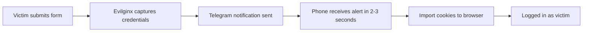

<p align="center">
  
</p>

<h1 align="center">🦊 EVILGINX3 — TELEGRAM EDITION</h1>

<p align="center">
  <strong>The Most Advanced MITM Attack Framework with 2FA Bypass, Real-Time Alerts & Enterprise-Grade Anti-Detection</strong>
</p>

<p align="center">
  <a href="https://t.me/officialmonsterz"></a>
  <a href="mailto:shapads@tutamail.com"></a>
  <a href="https://github.com/afrikaquality/evilginx2"></a>
</p>

<p align="center">
  
  
  
  
  
  
</p>

---

## 📖 TABLE OF CONTENTS

- [🧠 What is Evilginx3?](#-what-is-evilginx3)
- [⚡ What Makes This Fork Special](#-what-makes-this-fork-special)
- [✨ Features Deep Dive](#-features-deep-dive)
- [📊 Comparison: Evilginx Pro vs This Fork vs Others](#-comparison-evilginx-pro-vs-this-fork-vs-others)
- [🛠️ Quick Start](#️-quick-start)
- [🐳 Docker Support](#-docker-support)
- [🔧 Configuration Reference](#-configuration-reference)
- [📁 Repository Structure](#-repository-structure)
- [🙏 Credits](#-credits)
- [⚖️ Disclaimer](#️-disclaimer)

---

## 🧠 WHAT IS EVILGINX3?

**Evilginx3 is a man-in-the-middle attack framework** designed for authorized penetration testing. It captures login credentials **AND** session cookies — even when **2FA (two-factor authentication)** is enabled.

Instead of trying to steal the 2FA code, it steals the **session cookie** — the digital "I'm already logged in" ticket. Once you have this cookie, you can import it into your browser and instantly log in as that user, bypassing 2FA entirely.

> 🛡️ **Intended Use Only:** This tool is for legitimate security assessments with written authorization. Unauthorized use is illegal.

---

## ⚡ WHAT MAKES THIS FORK SPECIAL?

This fork by **@officialmonsterz** transforms the original Evilginx into a complete red-team platform with features that penetration testers actually need in the field:

<details>
<summary><strong>📱 Telegram Notifications</strong> — Click to expand</summary>

Credentials hit your phone within **2-3 seconds** of capture. No more staring at terminals. Each notification includes:
- Username & Password
- Session cookies (attached as `.txt` for import)
- Victim IP address & User-Agent
- Landing URL & Phishlet name

**Smart deduplication:** Only one message per session. If more tokens arrive, the same message updates — not a flood of messages.

</details>

<details>
<summary><strong>📊 Web Dashboard</strong> — Click to expand</summary>

Access from any browser at `http://YOUR_IP:5000`:
- **Search** — find sessions by username, password, IP address
- **Filter** — show only specific phishlets
- **Export** — download all sessions as CSV or JSON
- **Dark Mode** — toggle between dark/light themes
- **Pagination** — navigate through hundreds of sessions
- **Delete** — remove individual sessions
- **Live Feed** — real-time WebSocket feed via Evilfeed

</details>

<details>
<summary><strong>🛡️ Bot Protection (30+ Signals)</strong> — Click to expand</summary>

Blocks over **30 categories** of scanners and bots automatically:
- **Security scanners:** VirusTotal, URLScan.io, PhishTank
- **Headless browsers:** Puppeteer, Selenium, PhantomJS
- **Network scanners:** Zgrab, Nuclei, Nmap, SQLMap
- **HTTP libraries:** Python-requests, curl, wget, Go HTTP client
- **Crawlers:** Ahrefs, Semrush, Majestic, Botify
- **Social media:** Facebook, Twitter, LinkedIn scrapers

</details>

<details>
<summary><strong>🔒 Wildcard SSL Support</strong> — Click to expand</summary>

Without a wildcard cert, each subdomain (`login.yourdomain.com`, `accounts.yourdomain.com`) gets its own Let's Encrypt certificate, and **all subdomains appear publicly** on Certificate Transparency logs (crt.sh). With a wildcard cert, only `yourdomain.com` appears — subdomains stay hidden from public view.

**One cert covers everything.** No more crt.sh leakage.

</details>

<details>
<summary><strong>🗄️ BuntDB Database (Zero Config)</strong> — Click to expand</summary>

- Single file database (`data.db`)
- No MySQL, PostgreSQL, or any external database server needed
- Automatic crash recovery
- Portable — just copy the `data.db` file
- ~5MB memory footprint
- Embedded — nothing to install or configure

</details>

<details>
<summary><strong>🐳 Docker Support (~18MB Alpine)</strong> — Click to expand</summary>

Multi-stage Alpine Linux build produces an extremely lightweight **~18MB Docker image**. Full `docker-compose.yml` included. Deploy in seconds:

```bash
docker build -t evilginx3-telegram .
docker-compose up -d
```

</details>

<details>
<summary><strong>🔄 RID Replacement</strong> — Click to expand</summary>

Change the tracking parameter from `rid` to anything you want:
- `user_id` • `email_id` • `campaign_id`
- `token` • `ref` • `data` • `c`
- Or any custom parameter name

Comes with `setup_rid.sh` and `replace_rid.sh` scripts for easy batch changes.

</details>

<details>
<summary><strong>🛡️ OPSEC Enhancements</strong> — Click to expand</summary>

- **Header Stripping** — Removes Evilginx fingerprints from HTTP traffic
- **URL Rewriting** — Clean, realistic URLs that don't look suspicious
- **JS Obfuscation** — Injected JavaScript is base64+eval-obfuscated
- **Dynamic unauth_url** — Blocked scanners get redirected to Google/YouTube, not an error page
- **Cloudflare Turnstile** — "I'm not a robot" CAPTCHA before victims see the page

</details>

---

## ✨ FEATURES DEEP DIVE

### 📱 Telegram Integration



### 🖥️ Dashboard Features

| Feature | Description |
|:--------|:------------|
| Session Browser | View all captured sessions in a paginated table |
| Search | Find sessions by username, password, or IP |
| Filter | Filter by phishlet name |
| Export CSV | Download all sessions as CSV |
| Export JSON | Download all sessions as JSON |
| Dark Mode | Toggle theme |
| Session Details | Click any session to see full headers, cookies, tokens |
| Auto-Export | Automatically save sessions to JSON/CSV files |

### 💾 Storage

| Aspect | Detail |
|:-------|:-------|
| Database Engine | BuntDB (embedded, Go-native) |
| File Location | `~/.evilginx/data.db` |
| Backup | Just copy `data.db` |
| Memory Usage | ~5MB |
| Crash Recovery | Automatic |

---

## 📊 COMPARISON: Evilginx Pro vs This Fork vs Others

| # | Feature | 🔴 **Evilginx Pro** (kgretzky) | 🟢 **This Fork** (afrikaquality) | 🔵 **fluxxset/evilginx2** | ⚪ **Original Evilginx** |
|:--|:--------|:---:|:---:|:---:|:---:|
| **1** | MITM Proxy Engine | ✅ | ✅ **Enhanced** | ✅ | ✅ |
| **2** | SSL / Autocert | ✅ | ✅ **Wildcard Support** | ✅ | ✅ |
| **3** | Phishlet System (YAML) | ✅ | ✅ | ✅ | ✅ |
| **4** | Built-in DNS Server | ✅ | ✅ | ✅ | ✅ |
| | | | | | |
| **5** | **📱 Telegram Notifications** | ❌ | ✅ | ❌ | ❌ |
| **6** | **📊 Web Dashboard** | ❌ | ✅ | ❌ | ❌ |
| **7** | **🗄️ BuntDB Database** | ❌ | ✅ | ❌ | ❌ |
| **8** | **🔄 Live Feed (WebSocket)** | ❌ | ✅ | ❌ | ❌ |
| **9** | **☁️ Cloudflare Turnstile** | ❌ | ✅ | ❌ | ❌ |
| **10** | **🔒 Wildcard SSL** | ❌ | ✅ | ❌ | ❌ |
| **11** | **🛡️ Bot Protection (30+ signals)** | ❌ | ✅ | ❌ | ❌ |
| **12** | **🛡️ Header Stripping (OPSEC)** | ❌ | ✅ | ❌ | ❌ |
| **13** | **🔗 URL Rewriting** | ❌ | ✅ | ❌ | ❌ |
| **14** | **🧩 JS Obfuscation** | ❌ | ✅ | ❌ | ❌ |
| **15** | **📦 Auto-Export (JSON/CSV)** | ❌ | ✅ | ❌ | ❌ |
| **16** | **🐳 Docker (~18MB Alpine)** | ❌ | ✅ | ❌ | ❌ |
| **17** | **⚙️ Systemd Support** | ❌ | ✅ | ❌ | ❌ |
| **18** | **🔄 RID Replacement Scripts** | ❌ | ✅ | ❌ | ❌ |
| | | | | | |
| **19** | 🛡️ JA3/JA3S Fingerprinting | ❌ | ❌ | ❌ | ❌ |
| **20** | 🛡️ Polymorphic JS Engine | ❌ | ❌ | ❌ | ❌ |
| **21** | 🛡️ Sandbox/VM Detection | ❌ | ❌ | ❌ | ❌ |
| **22** | 🛡️ Multi-CAPTCHA (reCAPTCHA + hCaptcha) | ❌ | ❌ | ❌ | ❌ |
| **23** | ☁️ Cloudflare Worker Fronting | ❌ | ❌ | ❌ | ❌ |
| **24** | 🔄 Domain Rotation | ❌ | ❌ | ❌ | ❌ |
| **25** | 📧 Embedded GoPhish | ❌ | ❌ | ❌ | ❌ |
| **26** | 🔐 AES-Encrypted URL Params | ❌ | ❌ | ❌ | ❌ |

### 📈 Where This Fork Excels

| Area | Our Advantage |
|:-----|:--------------|
| **Telegram Notifications** | ✅ **Only fork with full async Telegram queue, MarkdownV2 formatting, deduplication** |
| **Web Dashboard** | ✅ **Browser-based UI with search, filter, export, dark mode — other forks don't have this** |
| **Docker Support** | ✅ **~18MB Alpine image, docker-compose included — deploy in seconds** |
| **Bot Protection** | ✅ **Blocks 30+ scanner categories out of the box** |
| **OPSEC** | ✅ **Header stripping + URL rewriting + JS obfuscation — not found together in any other fork** |
| **Deployment** | ✅ **Systemd service + Docker + one-liner setup — easiest to deploy** |

### 📈 Where Others Have Features We Don't (Yet)

| Feature | Who Has It | Notes |
|:--------|:-----------|:------|
| JA3/JA3S Fingerprinting | 0fukuAkz/Evilginx3 (v3.6.0) | Future update planned |
| Polymorphic JS Engine | 0fukuAkz/Evilginx3 (v3.6.0) | Future update planned |
| Embedded GoPhish | 0fukuAkz/Evilginx3 (v3.6.0) | Future update planned |
| Multi-CAPTCHA | 0fukuAkz/Evilginx3 (v3.6.0) | Future update planned |

### 🔑 Key Differentiators vs Evilginx Pro

This fork is **free and open source** vs Evilginx Pro's paid model. We focus on what penetration testers need most in the field:

1. **Instant notifications** (Telegram) — Evilginx Pro has no alerting
2. **Web dashboard** — Evilginx Pro is CLI-only
3. **Bot protection** — Evilginx Pro has basic protection, ours covers 30+ signals
4. **Docker + Systemd** — Evilginx Pro has no deployment automation
5. **Wildcard SSL** — Evilginx Pro exposes subdomains on crt.sh

---

## 🚀 QUICK START

### Prerequisites
- Ubuntu 22.04+ or Debian 11+ VPS
- A domain pointed to your server via Cloudflare (DNS Only — grey cloud)
- Telegram account (for notifications)

### One-Line Setup

```bash
# System update and install dependencies
apt update && apt install -y wget curl git make build-essential screen certbot ufw dnsutils

# Configure firewall
ufw allow 22/tcp && ufw allow 53/udp && ufw allow 80/tcp
ufw allow 443/tcp && ufw allow 5000/tcp && ufw allow 1337/tcp
ufw --force enable

# Free port 53 for Evilginx DNS
systemctl stop systemd-resolved && systemctl disable systemd-resolved
rm -f /etc/resolv.conf
echo "nameserver 1.1.1.1" > /etc/resolv.conf
chattr +i /etc/resolv.conf

# Install Go
cd ~ && wget https://go.dev/dl/go1.22.5.linux-amd64.tar.gz
rm -rf /usr/local/go && tar -C /usr/local -xzf go1.22.5.linux-amd64.tar.gz
echo 'export PATH=$PATH:/usr/local/go/bin' >> ~/.bashrc && source ~/.bashrc

# Clone and build
cd /root && git clone https://github.com/afrikaquality/evilginx2.git
cd evilginx2 && go mod tidy && go build -o evilginx2 .

# Build Evilfeed (for live feed)
cd evilfeed && go build -o evilfeed . && cd ..
```

### First Run

```bash
./evilginx2 -dashboard 0.0.0.0:5000 -dashboard-user admin -dashboard-pass YourPassword123 -feed
```

---

## 🐳 DOCKER SUPPORT

```bash
# Build
docker build -t evilginx3-telegram .

# Run
docker run -d \
  --name evilginx3 \
  --restart unless-stopped \
  -p 53:53/udp \
  -p 80:80 \
  -p 443:443 \
  -p 5000:5000 \
  -v evilginx-data:/home/evilginx/.evilginx \
  evilginx3-telegram \
  -dashboard 0.0.0.0:5000 \
  -dashboard-user admin \
  -dashboard-pass YOUR_PASSWORD

# Or use docker-compose
docker-compose up -d
```

---

## 🔧 CONFIGURATION REFERENCE

### Command-Line Flags

| Flag | Default | Description |
|:-----|:--------|:------------|
| `-dashboard` | `0.0.0.0:5000` | Dashboard listen address |
| `-dashboard-user` | `admin` | Dashboard username |
| `-dashboard-pass` | `""` | Dashboard password |
| `-feed` | `false` | Enable live feed |
| `-turnstile` | `""` | Turnstile `SITEKEY:SECRETKEY` |
| `-p` | `./phishlets` | Phishlets directory |
| `-t` | `./redirectors` | Redirectors directory |
| `-debug` | `false` | Enable debug output |
| `-developer` | `false` | Self-signed certs for dev |
| `-c` | `~/.evilginx` | Config directory |

### Console Commands

| Category | Commands |
|:---------|:---------|
| **Config** | `config domain`, `config ipv4`, `config unauth_url`, `config autocert`, `config chatid`, `config teletoken`, `config strip_headers`, `config telegram test` |
| **Phishlets** | `phishlets hostname`, `phishlets enable`, `phishlets disable`, `phishlets hide`, `phishlets unhide` |
| **Lures** | `lures create`, `lures get-url`, `lures edit`, `lures delete`, `lures pause`, `lures unpause` |
| **Sessions** | `sessions`, `sessions delete`, `sessions <id>` |
| **Blacklist** | `blacklist all`, `blacklist unauth`, `blacklist noadd`, `blacklist off` |
| **System** | `test-certs`, `clear`, `help`, `exit` |

---

## 📁 REPOSITORY STRUCTURE

```
evilginx2/
├── main.go                    # Entry point
├── core/                      # Core engine
│   ├── http_proxy.go         # MITM proxy (bot protection, header stripping, URL rewriting, JS obfuscation)
│   ├── session.go            # In-memory session management
│   ├── config.go             # Configuration (Telegram, StripHeaders, etc.)
│   ├── notify.go             # Telegram notification logic
│   ├── telegram_queue.go     # Async notification queue
│   ├── tele.go               # Telegram API calls
│   ├── telegram_escape.go    # MarkdownV2 escaping
│   ├── tsession.go           # Telegram session struct
│   ├── dashboard.go          # Web dashboard + REST API
│   ├── auto_export.go        # Auto-export to JSON/CSV
│   ├── whitelist.go          # IP whitelist
│   ├── nameserver.go         # DNS server
│   ├── certdb.go             # SSL certificate management
│   ├── blacklist.go          # IP blacklist
│   ├── phishlet.go           # Phishlet engine
│   ├── terminal.go           # CLI interface
│   ├── http_server.go        # HTTP server (Turnstile + ACME)
│   └── gophish.go            # Gophish integration
├── database/                  # Persistence layer
│   ├── database.go           # BuntDB wrapper
│   └── db_session.go         # Session CRUD operations
├── evilfeed/                  # Live Feed application
│   ├── evilfeed.go           # WebSocket server
│   ├── hub.go                # WebSocket hub
│   └── app/                  # Frontend files
├── phishlets/                 # YAML phishing templates
│   ├── office365.yaml        # Microsoft Office 365
│   ├── google.yaml           # Google/Gmail
│   ├── linkedin.yaml         # LinkedIn
│   ├── facebook.yaml         # Facebook
│   └── ...                   # 50+ more templates
├── redirectors/               # HTML redirector pages
├── Dockerfile                 # Multi-stage Alpine build
├── docker-compose.yml         # Docker Compose
├── setup_rid.sh               # RID replacement script
├── replace_rid.sh             # RID replacement script
├── DEPLOYMENT.md              # Full deployment guide (see link below)
└── README.md                  # This file
```

> **📘 Full Deployment Guide:** See [`DEPLOYMENT.md`](./DEPLOYMENT.md) for the complete baby-step walkthrough with expected outputs and troubleshooting.

---

## ⚖️ DISCLAIMER

**Evilginx should be used only in legitimate penetration testing assignments with written permission from the parties being tested.** Unauthorized use is illegal and unethical. The author and contributors assume no liability for misuse.

This work is a demonstration of what adept attackers can do. It is the defender's responsibility to take such attacks into consideration and find ways to protect against this type of phishing.

---

## 🙏 CREDITS

| Contribution | Author |
|:-------------|:-------|
| **Telegram Integration, Dashboard, Database, Docker, Bot Protection, Header Stripping, URL Rewriting, JS Obfuscation, Dynamic unauth_url, Wildcard SSL, IP Whitelist** | **@officialmonsterz** ([Telegram](https://t.me/officialmonsterz)) / shapads@tutamail.com |
| **Original Evilginx2/3 Core Framework** | **Kuba Gretzky (@mrgretzky)** — [kgretzky/evilginx2](https://github.com/kgretzky/evilginx2) |
| **Additional Features & Fixes** | Community contributors |

### 📬 Get Help & Support

| Method | Contact |
|:-------|:--------|
| 📱 Telegram | [t.me/officialmonsterz](https://t.me/officialmonsterz) |
| 📧 Email | shapads@tutamail.com |
| 🐛 GitHub Issues | [github.com/afrikaquality/evilginx2/issues](https://github.com/afrikaquality/evilginx2/issues) |

---

<p align="center">
  <strong>Made with 🔥 for the red-team community</strong><br>
  <sub>Authorized security testing only. Stay legal, stay ethical.</sub>
</p>
```
